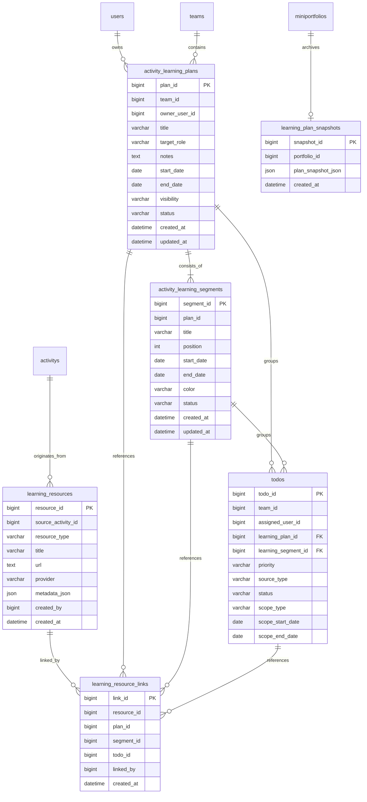

# StudyPilot 핵심 기능의 끼리끼리 통합 설계안

> 관련 이슈: [#73](https://github.com/C4t4ddict/kkiri-kkiri/issues/73)  
> 작성 기준일: 2026-08-14  
> 분석 대상: `C4t4ddict/studypilot-flutter-app` `main` (`3bf8928`), `C4t4ddict/kkiri-kkiri` `develop` (`e141095`)  
> 문서 범위: 통합 가능성 검토와 구현 설계만 포함하며, 끼리끼리 애플리케이션 코드는 변경하지 않는다.

## 1. 결론

StudyPilot의 핵심 기능은 끼리끼리에 통합할 수 있다. 다만 StudyPilot 앱 전체나 Flutter/Supabase 코드를 직접 합치는 방식은 권장하지 않는다.

가장 적합한 방향은 StudyPilot의 핵심 도메인인 **학습 가이드라인 → 커리큘럼 → 구간별 목표 → 할 일 → 캘린더/진행률** 흐름을 끼리끼리의 **활동 탭 내부 학습 로드맵 기능**으로 재설계하는 것이다.

통합 시 지켜야 할 핵심 원칙은 다음과 같다.

1. 끼리끼리의 React Native, Express, MySQL, 인증 체계를 그대로 사용한다.
2. 기존 `teams`, `team_members`, `todos`, 활동 캘린더, 미니포트폴리오를 재사용한다.
3. StudyPilot의 별도 인증, Supabase 테이블, Flutter 화면, 로컬 저장 구조는 가져오지 않는다.
4. 새로 필요한 데이터는 학습 계획과 커리큘럼 구간에 한정한다.
5. 기존 할 일에 학습 계획 연결 정보를 추가하되 두 번째 할 일 시스템을 만들지 않는다.
6. 초기 버전은 AI 자동 생성이나 문서 분석 없이 수동 학습 로드맵과 기존 할 일 연결에 집중한다.

이 방식이면 끼리끼리의 정체성인 **활동 탐색 → 팀 매칭 → 협업 및 목표 관리 → 활동 결과 포트폴리오화** 흐름에 StudyPilot의 학습 설계 기능을 자연스럽게 추가할 수 있다.

---

## 2. 분석 범위와 근거

### 2.1 StudyPilot 분석 대상

- 저장소: [C4t4ddict/studypilot-flutter-app](https://github.com/C4t4ddict/studypilot-flutter-app)
- 기준 커밋: `3bf892874c06556c9e2e38475048864b526a47a7`
- 기술 스택: Flutter/Dart, `go_router`, Supabase, SharedPreferences
- 주요 분석 파일
  - [`README.md`](https://github.com/C4t4ddict/studypilot-flutter-app/blob/main/README.md)
  - [`lib/services/planner_service.dart`](https://github.com/C4t4ddict/studypilot-flutter-app/blob/main/lib/services/planner_service.dart)
  - [`lib/services/search_service.dart`](https://github.com/C4t4ddict/studypilot-flutter-app/blob/main/lib/services/search_service.dart)
  - [`lib/features/planner/learning_page.dart`](https://github.com/C4t4ddict/studypilot-flutter-app/blob/main/lib/features/planner/learning_page.dart)
  - [`lib/features/planner/calendar_page.dart`](https://github.com/C4t4ddict/studypilot-flutter-app/blob/main/lib/features/planner/calendar_page.dart)
  - [`supabase/sql/003_planner_core.sql`](https://github.com/C4t4ddict/studypilot-flutter-app/blob/main/supabase/sql/003_planner_core.sql)

### 2.2 참고 확장 저장소

- 저장소: [C4t4ddict/SPO_PRD](https://github.com/C4t4ddict/SPO_PRD)
- 기준 커밋: `be516f96b6c8981253ae767c4f3de81088e1ceb9`
- 참고 범위
  - 스터디 모집과 매칭
  - 스터디 세션 및 출석
  - 학습 자료 업로드
  - PDF Vision/OCR 분석
  - AI 요약 및 토론 주제 생성

`SPO_PRD`는 StudyPilot Flutter 앱보다 범위가 큰 별도 제품 설계이므로, 본 문서에서는 장기 확장 아이디어로만 다룬다.

### 2.3 끼리끼리 분석 대상

- 저장소: `C4t4ddict/kkiri-kkiri`
- 기준 브랜치: `develop`
- 기준 커밋: `e141095`
- 현재 재사용 가능한 주요 기능
  - 외부 활동 및 공모전 정보 수집과 조회
  - 관심 활동
  - 팀 모집, 지원, 매칭, 팀 구성
  - 팀원과 역할 관리
  - 월간·주간·일일 할 일
  - 기간 목표와 활동 캘린더
  - 링 그래프, 히트맵, 이슈 트래커
  - 지난 활동과 미니포트폴리오
  - 수상 내역과 PDF 출력

---

## 3. StudyPilot 핵심 기능 정리

### 3.1 제품의 핵심 사용자 흐름

StudyPilot의 핵심 흐름은 다음과 같다.

1. 사용자가 목표 직무나 학습 목적을 담은 가이드라인을 작성한다.
2. 가이드라인을 바탕으로 기간이 있는 커리큘럼을 만든다.
3. 커리큘럼을 여러 학습 구간으로 나눈다.
4. 구간별 또는 날짜별 할 일을 추가한다.
5. 할 일을 `todo`, `in_progress`, `done` 상태로 관리한다.
6. 월간·주간 캘린더에서 커리큘럼 구간과 할 일을 함께 본다.
7. 진행률과 최근 학습 활동을 대시보드에서 확인한다.
8. 검색한 학습 자료를 커리큘럼 또는 할 일에 연결한다.

### 3.2 기능별 현재 구현 수준

| 기능 | 현재 구현 형태 | 끼리끼리 통합 판단 |
|---|---|---|
| 학습 가이드라인 | Supabase 또는 데모 로컬 저장 | 개념 재사용 권장 |
| 커리큘럼 | 시작일·종료일과 구간 목록 | 핵심 통합 대상 |
| 커리큘럼 구간 | 이름·종료일·순서·색상 | 핵심 통합 대상 |
| 할 일 | 상태·우선순위·마감일 | 기존 끼리끼리 할 일 확장 |
| 캘린더 | 월/주 보기, 상태 필터, 구간 선 표시 | 기존 활동 캘린더 확장 |
| 진행 통계 | 완료·진행·대기와 최근 7일 | 기존 링·히트맵 확장 |
| 자료 검색 | `search_items` 데모 데이터 | 그대로 도입하지 않음 |
| 자료 북마크/연결 | SharedPreferences 로컬 저장 | 서버 기반으로 재설계 |
| 프로필 학습 성향 | 일부 SharedPreferences 저장 | MVP 제외 또는 계정 기능과 통합 |
| 인증 | Supabase와 데모 로그인 병행 | 도입 금지 |

### 3.3 StudyPilot 구현상 확인된 한계

StudyPilot의 아이디어는 활용 가치가 높지만 현재 코드를 직접 이식하기에는 다음 문제가 있다.

#### 스키마와 서비스 불일치

`planner_service.dart`는 `curriculums` 행에 `segments`를 저장하고 조회한다. 그러나 `003_planner_core.sql`의 `curriculums` 테이블에는 `segments` 컬럼이 정의되어 있지 않다. 현재 저장소만 기준으로 보면 실제 Supabase 환경에 별도 마이그레이션이 있거나, 실행 시 오류가 날 가능성이 있다.

따라서 커리큘럼 구간은 JSON 컬럼을 그대로 복제하지 말고 별도 정규화 테이블로 설계해야 한다.

#### 로컬 저장 의존

다음 기능은 서버 DB가 아니라 SharedPreferences에 저장된다.

- 검색 자료 북마크
- 최근 검색어
- 자료와 커리큘럼/할 일의 연결
- 일부 프로필 학습 설정
- 데모 모드의 학습 데이터

이 구조는 기기 변경, 로그아웃, 여러 기기 동기화, 팀 공유, 관리자 감사에 취약하다. 끼리끼리에서는 MySQL에 저장해야 한다.

#### 데모 인증과 운영 인증 혼재

StudyPilot에는 Supabase 미설정 시 동작하는 데모 로그인 흐름이 있다. 이런 방식은 끼리끼리의 회원 권한, 학교 인증, 관리자 권한과 충돌하므로 가져오지 않는다.

#### 테스트 신뢰도 부족

현재 테스트는 계산 예제와 Flutter 기본 카운터 테스트 수준이라 핵심 학습 흐름, Supabase 스키마, 캘린더, 자료 연결을 검증하지 못한다. 따라서 코드를 복사하기보다 요구사항과 도메인 흐름만 참고해 끼리끼리 테스트 체계에 맞춰 새로 구현해야 한다.

#### 로컬 Flutter 검증 불가

문서 작성 환경에는 Flutter SDK가 설치되어 있지 않아 `flutter analyze`와 `flutter test`는 실행하지 못했다. 위 평가는 저장소 소스, SQL, 테스트 파일, 이슈와 병합 기록을 정적 분석한 결과다.

---

## 4. 끼리끼리와의 기능 적합성

### 4.1 높은 적합성

#### 활동 기반 학습 로드맵

끼리끼리의 사용자는 공모전, 프로젝트, 학습 공동체 같은 활동 단위로 팀에 참여한다. StudyPilot의 커리큘럼은 이 활동을 성공시키기 위한 구체적인 학습 경로로 활용할 수 있다.

예시:

- 활동: 데이터 분석 공모전
- 학습 목표: 예선 제출 전 분석 파이프라인 완성
- 학습 구간
  1. 데이터 이해와 전처리
  2. 탐색적 분석
  3. 모델링과 검증
  4. 발표 자료 작성
- 기존 끼리끼리 할 일
  - 결측치 처리 기준 정리
  - 베이스라인 모델 작성
  - 교차 검증 결과 비교

이 구조는 활동과 할 일 사이의 중간 계층을 제공한다. 지금보다 사용자가 “왜 이 할 일을 하는지”와 “전체 과정에서 어디까지 왔는지”를 이해하기 쉬워진다.

#### 캘린더와 진행률

끼리끼리에는 이미 활동 캘린더, 기간 목표, 일일 할 일 개수, 링 그래프, 히트맵이 있다. StudyPilot의 구간별 커리큘럼은 새로운 캘린더를 만드는 대신 기존 캘린더에 별도 트랙으로 표시할 수 있다.

#### 미니포트폴리오

활동 종료 시 현재는 역할, 기간, 완료 작업을 스냅샷으로 저장한다. 여기에 학습 계획과 완료한 구간을 포함하면 “어떤 일을 했는지”뿐 아니라 “어떤 역량을 어떤 순서로 학습했는지”까지 기록할 수 있다.

### 4.2 조건부 적합성

#### 학습 자료 검색과 연결

StudyPilot의 검색 데이터는 데모 성격이 강하다. 별도 검색 서비스를 그대로 가져오는 것보다 끼리끼리의 기존 활동 정보와 관심 활동을 먼저 학습 자료처럼 연결하는 것이 현실적이다.

초기 지원 대상:

- 정보 탭의 공모전·대외활동 상세
- 관심 활동
- 사용자가 직접 입력한 외부 URL

후속 지원 대상:

- 파일 업로드
- PDF 본문 추출
- OCR
- AI 요약과 토론 질문 생성

#### 개인 학습 계획

StudyPilot은 기본적으로 개인 계획 중심이고 끼리끼리는 팀 활동 중심이다. 처음부터 전역 개인 플래너를 추가하면 제품 범위와 내비게이션이 복잡해질 수 있다. MVP에서는 선택한 팀/활동 안의 개인 계획과 팀 공유 계획만 지원하는 것이 좋다.

### 4.3 통합하지 않아야 할 항목

| 항목 | 이유 |
|---|---|
| Flutter 화면 코드 | 끼리끼리는 React Native이므로 직접 재사용 가치가 낮음 |
| Supabase 인증 | 기존 회원·학교 인증·관리자 권한과 충돌 |
| Supabase RLS 정책 | 끼리끼리는 Express 서비스 계층에서 권한을 검증함 |
| StudyPilot 별도 Todo 테이블 | 기존 `todos`와 상태·캘린더·포트폴리오가 중복됨 |
| StudyPilot 별도 캘린더 탭 | 끼리끼리 활동 캘린더와 중복됨 |
| SharedPreferences 북마크 | 기기 간 동기화와 팀 공유가 불가능함 |
| 데모 관리자·데모 로그인 | 운영 보안과 사용자 식별을 훼손함 |
| 전체 SPO_PRD 기능의 일괄 도입 | 세션·출석·보상·AI는 별도 제품 수준의 범위임 |

---

## 5. 권장 제품 구조

### 5.1 기능 이름

사용자에게는 `학습 로드맵`이라는 이름을 권장한다.

- 내부 도메인명: Learning Plan
- 사용자 노출명: 학습 로드맵
- 하위 구성: 목표, 학습 구간, 연결된 할 일, 참고 자료, 진행률

`커리큘럼`은 교육 서비스 느낌이 강하고 공모전·프로젝트에는 어색할 수 있다. 화면에서는 `학습 로드맵`과 `구간`을 사용하고, DB와 API에서는 범용적인 `learning_plan`, `learning_segment`를 사용한다.

### 5.2 끼리끼리 사용자 여정에 넣는 위치


### 5.3 내비게이션 원칙

- 하단 탭을 추가하지 않는다.
- `홈`, `정보`, `활동`, `매칭`, `마이페이지` 구조를 유지한다.
- 학습 로드맵은 활동 탭에서 현재 선택한 활동의 위젯으로 접근한다.
- 활동 위젯 설정에서 노출 여부와 순서를 변경할 수 있게 한다.
- 상세 편집은 별도 화면으로 이동하되 활동 선택 상태를 유지한다.

### 5.4 활동 유형별 기본 동작

| 활동 유형 | 로드맵 기본 노출 | 예시 |
|---|---:|---|
| 스터디·학습 공동체 | 켜짐 | 과목 학습 순서, 시험 대비 |
| 공모전 | 켜짐 | 분석·개발·제출 구간 |
| 프로젝트 | 켜짐 | 기획·구현·검증·배포 |
| 봉사·행사 | 선택 | 사전 교육이나 역할 준비가 있을 때 |
| 단기 세미나·관람 | 꺼짐 | 필요 시 사용자가 직접 활성화 |

---

## 6. 권장 데이터 모델

### 6.1 설계 원칙

1. 기존 팀과 사용자를 참조한다.
2. 기존 할 일을 재사용한다.
3. 커리큘럼 구간은 JSON 배열이 아니라 별도 테이블로 정규화한다.
4. 개인 계획과 팀 공유 계획을 같은 테이블에서 구분한다.
5. 활동 종료 시 원본 변경과 무관한 스냅샷을 남긴다.
6. 신규 테이블은 명시적인 마이그레이션으로 생성한다.

### 6.2 ERD



### 6.3 `activity_learning_plans`

| 컬럼 | 권장 타입 | 설명 |
|---|---|---|
| `plan_id` | BIGINT PK | 학습 로드맵 식별자 |
| `team_id` | BIGINT NOT NULL | 끼리끼리 활동 팀 |
| `owner_user_id` | BIGINT NOT NULL | 개인 계획 소유자 또는 팀 계획 생성자 |
| `title` | VARCHAR(120) | 로드맵 제목 |
| `target_role` | VARCHAR(100) NULL | 목표 역할·역량 |
| `notes` | TEXT NULL | 목표 설명 |
| `start_date` | DATE NOT NULL | 시작일 |
| `end_date` | DATE NOT NULL | 종료일 |
| `visibility` | ENUM 또는 VARCHAR | `PERSONAL`, `TEAM` |
| `status` | ENUM 또는 VARCHAR | `DRAFT`, `ACTIVE`, `COMPLETED`, `ARCHIVED` |
| `created_at` | DATETIME | 생성 시각 |
| `updated_at` | DATETIME | 수정 시각 |

권장 제약:

- `start_date <= end_date`
- `team_id`, `status` 인덱스
- `owner_user_id`, `status` 인덱스
- 같은 활동에서 여러 계획을 허용하되 MVP 화면은 활성 계획 한 개를 우선 표시

### 6.4 `activity_learning_segments`

| 컬럼 | 권장 타입 | 설명 |
|---|---|---|
| `segment_id` | BIGINT PK | 구간 식별자 |
| `plan_id` | BIGINT NOT NULL | 상위 로드맵 |
| `title` | VARCHAR(120) | 구간명 |
| `position` | INT NOT NULL | 표시 순서 |
| `start_date` | DATE NOT NULL | 구간 시작일 |
| `end_date` | DATE NOT NULL | 구간 종료일 |
| `color` | CHAR(7) | `#RRGGBB` 형식 |
| `status` | VARCHAR(20) | `PLANNED`, `ACTIVE`, `COMPLETED` |
| `created_at` | DATETIME | 생성 시각 |
| `updated_at` | DATETIME | 수정 시각 |

StudyPilot처럼 종료일만 저장하고 앞 구간의 종료일로 시작일을 추론할 수도 있지만, 날짜 변경·겹침·중간 구간 추가를 안정적으로 처리하려면 시작일과 종료일을 모두 저장하는 편이 낫다.

권장 제약:

- `(plan_id, position)` 고유 인덱스
- 구간 날짜는 상위 계획 범위 안에 있어야 함
- MVP에서는 구간 간 날짜 중첩을 허용하지 않음
- 구간 순서 변경과 날짜 변경을 한 트랜잭션으로 처리

### 6.5 기존 `todos` 확장

새로운 할 일 테이블을 만들지 않고 다음 nullable 컬럼을 기존 `todos`에 추가하는 방식을 권장한다.

| 컬럼 | 권장 값 | 설명 |
|---|---|---|
| `learning_plan_id` | 계획 ID 또는 NULL | 로드맵 소속 |
| `learning_segment_id` | 구간 ID 또는 NULL | 구간 소속 |
| `priority` | `LOW`, `MEDIUM`, `HIGH` | StudyPilot 우선순위 개념 |
| `source_type` | `MANUAL`, `PERIOD`, `LEARNING_PLAN`, `MATERIAL` | 생성 출처 |

기존 값은 그대로 유지한다.

- 상태: `미진행`, `진행중`, `완료`
- 범위: `일일`, `주간`, `월간`
- 담당자: `assigned_user_id`
- 팀: `team_id`
- 기간 목표: `range_group_id`, `range_start_date`, `range_end_date`, `range_color`

StudyPilot의 `todo`, `in_progress`, `done` 값을 새로 추가하지 않는다.

### 6.6 학습 자료

`learning_resources`는 자료 자체를 한 번 저장하고 여러 계획·구간·할 일에 연결하기 위한 테이블이다.

MVP의 `resource_type`:

- `KKIRI_ACTIVITY`: 끼리끼리 정보 탭의 활동
- `EXTERNAL_URL`: 사용자가 입력한 URL

후속 버전:

- `FILE`
- `PDF`
- `VIDEO`
- `ARTICLE`

`learning_resource_links`는 연결 대상을 표현한다. 다음 중 하나만 설정하도록 서비스에서 검증한다.

- `plan_id`
- `segment_id`
- `todo_id`

MySQL `CHECK` 제약의 실제 적용 여부가 배포 버전에 따라 달라질 수 있으므로 API 서비스 계층에서도 반드시 검증한다.

### 6.7 미니포트폴리오 스냅샷

활동 종료 시 현재 계획을 그대로 참조하면 이후 편집이나 데이터 정리로 과거 결과가 바뀔 수 있다. 따라서 미니포트폴리오 생성 시 다음 내용을 JSON 스냅샷으로 저장한다.

- 로드맵 제목과 목표 역할
- 전체 기간
- 구간명, 기간, 완료 상태
- 구간별 완료 할 일
- 연결 자료 제목과 URL
- 최종 진행률

이 스냅샷은 읽기 전용으로 유지하고 PDF 생성 시 사용한다.

---

## 7. 권한 설계

### 7.1 역할별 기본 권한

| 작업 | 개인 계획 소유자 | 팀장 | 같은 팀원 | 비팀원 | 관리자 |
|---|---:|---:|---:|---:|---:|
| `PERSONAL` 계획 조회 | 가능 | 불가 | 불가 | 불가 | 운영 목적 제한 조회 |
| `PERSONAL` 계획 수정 | 가능 | 불가 | 불가 | 불가 | 원칙적 불가 |
| `TEAM` 계획 조회 | 가능 | 가능 | 가능 | 불가 | 운영 목적 제한 조회 |
| `TEAM` 계획 생성 | 선택 | 가능 | 정책에 따라 가능 | 불가 | 원칙적 불가 |
| `TEAM` 계획 수정 | 생성자 정책 | 가능 | 제한 | 불가 | 원칙적 불가 |
| 본인 할 일 상태 변경 | 가능 | 가능 | 본인 것만 가능 | 불가 | 원칙적 불가 |
| 팀원 할 일 배정 | 불가 | 가능 | 기존 정책 따름 | 불가 | 원칙적 불가 |
| 활동 종료 후 조회 | 본인 포트폴리오 | 본인 포트폴리오 | 본인 포트폴리오 | 불가 | 운영 목적 제한 조회 |

### 7.2 권한 검증 순서

모든 학습 로드맵 API는 다음 순서로 검사한다.

1. 인증 토큰이 유효한가.
2. 요청 사용자가 존재하고 정지 상태가 아닌가.
3. 계획이 참조하는 팀에 현재 소속되어 있는가.
4. 계획의 `visibility`와 소유자 조건을 만족하는가.
5. 수정 요청이면 팀장 또는 편집 권한 보유자인가.
6. 연결하려는 할 일이 같은 팀에 속하는가.
7. 연결하려는 할 일의 담당자와 기존 수정 권한을 만족하는가.
8. 보관된 계획 또는 종료된 팀이면 쓰기 요청을 거부하는가.

자료나 계획 연결을 통해 원래 볼 수 없던 팀 할 일을 조회할 수 있게 해서는 안 된다.

### 7.3 학교 인증과의 관계

학습 로드맵은 팀이 이미 구성된 이후의 협업 기능이므로 학교 인증 정책을 별도로 복제하지 않는다. 학교/전국 모집 범위와 가입 권한은 기존 팀 구성 단계에서 결정하고, 로드맵은 해당 팀의 멤버십만 검사한다.

---

## 8. API 설계안

### 8.1 학습 로드맵

#### 목록 조회

`GET /teams/:teamId/learning-plans`

쿼리:

- `visibility=PERSONAL|TEAM|ALL`
- `status=ACTIVE|COMPLETED|ARCHIVED`

응답 요약:

- 계획 기본 정보
- 구간 수
- 연결된 할 일 수
- 완료 할 일 수
- 계산된 진행률

#### 생성

`POST /teams/:teamId/learning-plans`

요청 필드:

- `title`
- `targetRole`
- `notes`
- `startDate`
- `endDate`
- `visibility`
- 선택적 초기 `segments`

계획과 초기 구간은 한 트랜잭션으로 저장한다.

#### 상세 조회

`GET /learning-plans/:planId`

포함 데이터:

- 계획
- 정렬된 구간
- 구간별 할 일 요약
- 연결 자료
- 전체 진행률
- 현재 구간

#### 수정

`PATCH /learning-plans/:planId`

날짜 범위를 줄일 때 하위 구간이나 할 일이 범위를 벗어나면 자동 절단하지 않는다. `409 Conflict`와 충돌 항목을 반환하고 사용자가 조정하게 한다.

#### 상태 변경

`PATCH /learning-plans/:planId/status`

- `DRAFT -> ACTIVE`
- `ACTIVE -> COMPLETED`
- 팀 종료 시 `ACTIVE -> ARCHIVED`

완료된 계획을 다시 활성화하는 정책은 MVP에서 지원하지 않는 것이 안전하다.

### 8.2 학습 구간

- `POST /learning-plans/:planId/segments`
- `PATCH /learning-segments/:segmentId`
- `DELETE /learning-segments/:segmentId`
- `PUT /learning-plans/:planId/segments/order`

순서 변경 요청은 전체 구간 ID 목록을 받는다. 서버는 누락·중복·다른 계획 구간 포함 여부를 검증한 후 트랜잭션으로 일괄 변경한다.

구간 삭제 시 연결된 할 일을 삭제하지 않는다.

- 기본 동작: 할 일의 `learning_segment_id`만 NULL 처리
- 선택 동작: 다른 구간으로 이동
- 금지 동작: 사용자 확인 없이 할 일 삭제

### 8.3 기존 할 일과 연결

#### 구간에서 새 할 일 생성

`POST /learning-segments/:segmentId/todos`

기존 할 일 생성 규칙과 권한을 그대로 사용한다. 추가로 계획·구간 식별자와 `source_type=LEARNING_PLAN`을 저장한다.

#### 기존 할 일 연결

`PUT /todos/:todoId/learning-link`

요청:

```json
{
  "planId": 12,
  "segmentId": 47
}
```

검증:

- 할 일과 계획의 `team_id`가 같은가.
- 구간이 해당 계획에 속하는가.
- 요청자가 기존 할 일을 수정할 권한이 있는가.

#### 연결 해제

`DELETE /todos/:todoId/learning-link`

할 일 자체는 유지하고 연결만 해제한다.

### 8.4 대시보드

`GET /learning-plans/:planId/dashboard`

응답 항목:

- 전체 할 일 수
- 미진행·진행중·완료 수
- 전체 완료율
- 현재 구간 완료율
- 오늘 할 일과 완료 수
- 최근 7일 완료 추이
- 구간별 완료율
- 계획 종료일까지 남은 일수

진행률 계산은 서버가 표준화한다.

```text
진행률 = 완료 상태인 연결 할 일 수 / 전체 연결 할 일 수 × 100
```

할 일이 없는 계획의 진행률은 `0`으로 반환하고 완료로 간주하지 않는다.

### 8.5 학습 자료

- `GET /learning-plans/:planId/resources`
- `POST /learning-plans/:planId/resources`
- `POST /learning-resources/:resourceId/links`
- `DELETE /learning-resource-links/:linkId`

정보 탭 활동을 연결할 때 기존 `activitys`의 전체 본문을 복제하지 않고 `source_activity_id`를 저장한다. 활동이 삭제되거나 갱신되더라도 포트폴리오에는 연결 당시 제목과 URL을 스냅샷으로 남긴다.

### 8.6 오류 응답 원칙

| HTTP | 상황 |
|---:|---|
| 400 | 날짜 형식, 색상, 상태값 등 입력 오류 |
| 401 | 인증 없음 또는 만료 |
| 403 | 팀 소속·소유권·편집 권한 없음 |
| 404 | 계획·구간·할 일 없음 |
| 409 | 날짜 범위 충돌, 보관된 계획 수정, 순서 충돌 |
| 422 | 유효하지만 현재 규칙으로 처리 불가능한 연결 |

오류 메시지는 사용자용 `message`와 내부 식별용 `code`를 분리한다. SQL 오류나 내부 경로는 응답에 포함하지 않는다.

---

## 9. 화면 설계안

### 9.1 활동 탭의 학습 로드맵 위젯

기존 `Widget` 구조에 `LearningRoadmapWidget`을 추가하는 형태가 적합하다.

표시 항목:

- 로드맵 제목
- 목표 역할 또는 역량
- 현재 구간
- 전체 진행률
- 오늘 남은 할 일
- 다음 구간 시작일
- `로드맵 보기` 버튼

동작:

- 계획이 없으면 작은 빈 상태와 `로드맵 만들기` 버튼 표시
- 계획이 있으면 현재 구간 중심의 요약 표시
- 위젯 편집에서 켜기/끄기와 순서 변경 지원
- 기존 끼리끼리 보라색 토큰과 카드 규격 사용
- StudyPilot의 파란색 글래스모피즘을 그대로 가져오지 않음

### 9.2 학습 로드맵 상세 화면

상단:

- 활동명
- 로드맵 제목
- 목표 역할
- 기간
- 팀 공유/개인 배지
- 편집 버튼

본문:

1. 전체 진행률 카드
2. 현재 구간 강조 카드
3. 구간 타임라인
4. 선택 구간의 할 일 목록
5. 연결 자료 목록
6. 구간 추가 및 순서 편집

구간 타임라인은 세로형을 기본으로 한다. 작은 모바일 화면에서 여러 구간을 가로로 배치하면 텍스트와 날짜가 잘릴 가능성이 높다.

### 9.3 로드맵 생성 화면

1단계: 기본 정보

- 제목
- 목표 역할 또는 역량
- 설명
- 전체 기간
- 공개 범위

2단계: 구간 구성

- 구간명
- 시작일·종료일
- 색상
- 드래그 앤 드롭 순서 변경

3단계: 기존 할 일 연결

- 일일·주간·월간 필터
- 담당자 필터
- 여러 항목 선택
- 새 할 일 추가

저장 전 검증:

- 구간 날짜가 계획 기간을 벗어나지 않는가.
- 구간 순서와 날짜 순서가 일치하는가.
- 제목이 비어 있지 않은가.
- 팀 공유 계획을 만들 권한이 있는가.

### 9.4 기존 Todo 화면 확장

기존 디자인과 상태 변경 방식을 유지하면서 다음 정보만 추가한다.

- `로드맵` 필터
- `구간` 필터
- 우선순위 배지
- `로드맵에서 생성됨` 출처 표시
- 할 일 편집 화면의 로드맵·구간 선택

로드맵 화면에서 상태를 변경하면 기존 Todo API를 사용하고, Todo 화면과 링 그래프에 즉시 동일하게 반영되어야 한다.

### 9.5 활동 캘린더 확장

기존 기간 목표 선과 학습 구간 선을 같은 레이어에 무작정 합치면 겹침과 높이 문제가 발생한다. 다음처럼 의미를 분리한다.

- 셀 상단: 일일 남은 할 일 수
- 셀 중단: 기간 목표 트랙, 기존 최대 3개 정책 유지
- 셀 하단: 현재 학습 구간 트랙 1개

캘린더 설정:

- 기간 목표 표시
- 학습 구간 표시
- 일일·주간·월간 할 일 표시
- 상태별 표시

구간 색상은 사용자가 정하되 앱의 접근성 기준에 맞춰 너무 밝거나 대비가 낮은 색은 보정한다. 색상만으로 상태를 구분하지 않고 라벨 또는 패턴을 함께 제공한다.

### 9.6 정보 탭 연결

활동 상세의 저장 버튼 주변에 `학습 로드맵에 연결` 기능을 제공할 수 있다.

흐름:

1. 사용자가 활동 상세에서 연결 버튼 선택
2. 참여 중인 활동 선택
3. 해당 활동의 로드맵과 구간 또는 할 일 선택
4. 연결 완료 안내

관심 활동은 기존 관심 활동 목록에서 같은 방식으로 연결한다.

### 9.7 미니포트폴리오 확장

새 섹션 이름은 `학습 로드맵` 또는 `성장 과정`을 권장한다.

포함 항목:

- 목표 역할과 학습 목적
- 전체 기간과 최종 완료율
- 구간별 기간과 완료 상태
- 각 구간의 대표 완료 작업
- 참고한 자료
- 활동 회고와 연결

PDF에서는 구간 타임라인이 페이지 하단에서 잘리지 않도록 한 구간 카드의 높이를 먼저 계산하고, 공간이 부족하면 카드 전체를 다음 페이지로 이동한다.

---

## 10. 데이터 처리와 동기화

### 10.1 단일 데이터 원천

| 데이터 | 기준 시스템 |
|---|---|
| 사용자·학교 인증·관리자 권한 | 끼리끼리 회원 DB |
| 팀·멤버·역할 | 끼리끼리 팀 DB |
| 할 일 상태와 날짜 | 기존 끼리끼리 `todos` |
| 학습 계획과 구간 | 신규 학습 로드맵 테이블 |
| 정보 탭 활동 | 기존 `activitys` |
| 관심 활동 | 기존 관심 활동 테이블 |
| 과거 결과 | 기존 미니포트폴리오 + 로드맵 스냅샷 |

### 10.2 날짜 변경 정책

구간 기간을 변경할 때 연결된 할 일 날짜를 자동 이동시키면 사용자가 직접 정한 일정이 훼손될 수 있다.

권장 동작:

1. 변경 후 구간 밖으로 벗어나는 할 일을 조회한다.
2. 충돌이 없으면 바로 저장한다.
3. 충돌이 있으면 선택 모달을 표시한다.
   - 할 일을 새 기간에 맞춰 이동
   - 할 일 날짜 유지하고 구간 연결 해제
   - 변경 취소
4. 선택 결과를 하나의 트랜잭션으로 처리한다.

### 10.3 구간에서 일괄 할 일 생성

향후 템플릿으로 여러 할 일을 생성할 경우 중복 생성 방지가 필요하다.

- 요청에 `idempotencyKey` 사용
- `(plan_id, segment_id, idempotency_key)` 고유 보장
- 일부 생성 후 실패하면 전체 롤백
- 동일 키 재요청은 최초 결과 반환

### 10.4 캐시와 새로고침

- 활동 탭 진입 시 선택 팀의 활성 로드맵 요약 조회
- Pull-to-refresh에서 로드맵, Todo, 캘린더를 함께 갱신
- 할 일 상태 변경 후 관련 쿼리만 무효화
- 앱 재실행 시 서버 값을 우선 사용
- 오프라인 임시 편집은 MVP에서 제외하고 읽기 캐시만 허용

---

## 11. 기존 기능과의 연결 규칙

### 11.1 링 그래프

기존 링 그래프의 의미를 바꾸지 않는다. 학습 로드맵에 연결된 할 일도 기존 할 일이므로 자동으로 전체·월간·주간·일일 진행률에 반영된다.

필요하면 로드맵 상세 안에 별도 구간 진행률을 표시하되 활동 탭 메인 링을 중복 추가하지 않는다.

### 11.2 히트맵

완료한 로드맵 할 일은 기존 `completed_at`을 사용해 히트맵에 반영한다. 별도 학습 히트맵을 만들지 않는다.

### 11.3 이슈 트래커

오늘 날짜에 해당하고 미완료인 로드맵 할 일은 기존 이슈 트래커에 함께 표시한다. 출처 배지를 추가할 수 있지만 조회 기준을 분리하지 않는다.

### 11.4 기간 목표

기간 목표는 같은 일일 목표를 일정 기간 반복 생성하는 기능이고, 학습 구간은 여러 할 일을 묶는 상위 계획이다. 둘은 의미가 다르므로 다음처럼 구분한다.

| 구분 | 기간 목표 | 학습 구간 |
|---|---|---|
| 목적 | 같은 일일 행동 반복 | 단계별 학습 과정 구성 |
| 데이터 | 여러 Todo와 `range_group_id` | Segment와 연결된 여러 Todo |
| 완료 | 각 일일 Todo 완료 | 연결 Todo 완료율로 계산 |
| 캘린더 | 반복 기간 선 | 현재 구간 트랙 |

하나의 할 일이 기간 목표와 학습 구간에 동시에 속하는 것은 허용할 수 있다.

### 11.5 미니포트폴리오

기존 완료 할 일 스냅샷은 유지한다. 학습 로드맵 스냅샷은 별도 섹션으로 추가하고 기존 사용자가 편집한 포트폴리오 제목·역할·회고를 덮어쓰지 않는다.

---

## 12. 단계별 구현 계획

### Phase 0. 기술 설계 확정

목표: 실제 구현 전에 중복과 스키마 충돌을 제거한다.

- 현재 운영 MySQL의 `teams`, `team_members`, `todos`, `miniportfolios` 실제 컬럼 확인
- 기존 Todo 상태와 날짜 규칙 문서화
- 개인/팀 계획 편집 권한 확정
- 캘린더 트랙 최대 높이와 접근성 기준 확정
- 학습 로드맵 feature flag 정의
- 마이그레이션 롤백 계획 작성

완료 기준:

- ERD와 API 리뷰 완료
- DB 마이그레이션이 기존 데이터에 영향을 주지 않음
- MVP 비범위 확정

### Phase 1. 학습 로드맵 MVP

범위:

- 계획 생성·조회·수정·완료
- 구간 생성·수정·삭제·순서 변경
- 기존 할 일 생성·연결·해제
- 활동 탭 학습 로드맵 위젯
- 로드맵 상세와 편집 화면
- 기본 진행률

제외:

- 외부 자료 업로드
- AI 자동 생성
- PDF 분석
- 복잡한 리마인더
- 전역 개인 플래너 탭

출시 조건:

- 팀 소속과 개인 계획 권한 테스트 통과
- 기존 Todo, 링, 히트맵, 이슈 트래커 회귀 테스트 통과
- Android와 iOS 화면 검증

### Phase 2. 캘린더와 자료 연결

범위:

- 캘린더 학습 구간 트랙
- 정보 탭 활동 연결
- 관심 활동 연결
- 외부 URL 자료
- 최근 7일 및 구간별 통계
- 알림과 마감 리마인더

리마인더 예시:

- 구간 종료 3일 전인데 완료율 50% 미만
- 오늘 마감인 미완료 할 일 존재
- 다음 구간 시작일 도래

알림은 기존 끼리끼리 알림 체계를 사용한다.

### Phase 3. 미니포트폴리오 확장

범위:

- 팀 종료 시 학습 로드맵 스냅샷
- 미니포트폴리오 성장 과정 섹션
- PDF 구간 타임라인
- 구간별 대표 작업과 자료
- 사용자 편집 회고와 자동 요약 결과의 분리 저장

### Phase 4. 선택적 AI·자료 분석

`SPO_PRD`의 자료 분석 기능은 별도 후속 프로젝트로 진행한다.

가능한 범위:

- PDF 업로드
- 파일 시그니처·MIME·확장자 검증
- 페이지별 Vision 분석
- 실패 페이지 OCR 보조
- 문서 요약
- 학습 구간 후보와 토론 주제 추천

필요한 추가 인프라:

- 객체 스토리지
- 비동기 작업 큐
- 작업 상태 테이블
- 재시도와 실패 보관
- AI API 비용 제한
- 개인정보 및 저작권 정책
- 악성 파일 검사

이 단계는 MVP와 분리해야 한다. AI가 생성한 결과는 자동 저장하지 않고 사용자가 확인한 뒤 계획이나 할 일로 추가하도록 한다.

---

## 13. 권장 서버 구조

현재 `server/server.js`에 계속 라우트를 추가하면 유지보수가 어려워진다. 실제 구현 시 학습 기능은 모듈로 분리하는 것이 좋다.

```text
server/
  learning/
    routes.js
    controller.js
    service.js
    repository.js
    authorization.js
    validation.js
    progress.js
    test/
      authorization.tests.js
      progress.tests.js
      service.tests.js
  migrations/
    YYYYMMDD_create_activity_learning_plans.sql
    YYYYMMDD_create_activity_learning_segments.sql
    YYYYMMDD_extend_todos_for_learning.sql
```

역할:

- `routes.js`: URL과 미들웨어 연결
- `controller.js`: 요청/응답 변환
- `service.js`: 트랜잭션과 비즈니스 규칙
- `repository.js`: SQL 실행
- `authorization.js`: 팀·소유자·역할 검사
- `validation.js`: 날짜·상태·색상·문자 길이 검증
- `progress.js`: 진행률 계산 순수 함수

서버 시작 시 매번 `ALTER TABLE`을 실행하는 방식보다 버전이 있는 마이그레이션을 권장한다.

---

## 14. 테스트 전략

### 14.1 단위 테스트

- 진행률 계산
- 할 일이 없는 계획의 진행률
- 상태별 집계
- 현재 구간 선택
- 구간 날짜 겹침 검증
- 색상 형식 검증
- 순서 변경 검증
- StudyPilot 상태와 끼리끼리 상태 매핑

### 14.2 서비스 통합 테스트

- 개인 계획은 소유자만 조회·수정 가능
- 팀 계획은 같은 팀원만 조회 가능
- 팀장만 팀 계획 수정 가능 정책
- 다른 팀 Todo 연결 거부
- 보관된 계획 수정 거부
- 구간 삭제 시 Todo 보존과 연결 해제
- 계획 생성 중 구간 저장 실패 시 전체 롤백
- 활동 종료 시 스냅샷 한 번만 생성

### 14.3 API 테스트

- 정상 생성·조회·수정·삭제
- 잘못된 날짜와 상태값
- 인증 없음
- 권한 없음
- 없는 자원
- 날짜 충돌
- 동일 idempotency key 재요청

### 14.4 앱 테스트

- 활동 전환 시 해당 팀 로드맵만 표시
- 긴 활동명과 긴 구간명 말줄임
- 위젯 순서와 on/off 저장
- Todo 화면과 로드맵 화면 상태 동기화
- Pull-to-refresh 동기화
- 캘린더 작은 화면 오버플로 방지
- 기간 목표 3개와 학습 구간이 함께 있을 때 레이아웃
- iOS와 Android 날짜 선택기 차이
- VoiceOver/TalkBack 라벨
- 색각 이상 환경에서 상태 구분

### 14.5 회귀 테스트

반드시 기존 기능이 그대로 동작하는지 확인한다.

- 팀 모집과 지원
- 팀 생성과 멤버 권한
- 일일·주간·월간 할 일
- 기간 목표 최대 3개 정책
- 캘린더 일일 남은 개수
- 링 그래프 애니메이션과 진행률
- 히트맵
- 이슈 트래커
- 팀 종료와 지난 활동 이동
- 미니포트폴리오와 PDF

### 14.6 부하 테스트

우선 검증 시나리오:

- 활동 탭 진입 시 로드맵 요약 조회
- 로드맵 상세에서 구간별 Todo 집계
- 한 팀에 계획 5개, 구간 50개, Todo 2,000개
- 100명 동시 상태 변경
- 같은 계획 순서 변경 동시 요청

N+1 조회를 피하기 위해 계획 목록에서 구간과 Todo를 계획마다 별도 조회하지 말고 집계 쿼리 또는 묶음 조회를 사용한다.

---

## 15. 보안 및 개인정보

### 15.1 필수 보안 규칙

- 모든 쓰기 API는 로그인 사용자 ID를 요청 본문이 아닌 인증 토큰에서 가져온다.
- `teamId`, `planId`, `todoId`만 믿지 않고 관계를 DB에서 다시 확인한다.
- 팀 공유 계획과 개인 계획의 조회 쿼리를 분리하거나 명시적으로 범위를 제한한다.
- SQL 파라미터 바인딩을 사용한다.
- 제목·설명·URL 길이를 제한한다.
- URL 프로토콜은 `https`와 필요한 경우 `http`만 허용한다.
- 내부 IP, `file:`, `javascript:` 같은 URL은 거부한다.
- 관리자도 개인 계획을 일반 기능으로 수정할 수 없게 한다.
- 감사가 필요한 변경은 actor, 대상, 시각을 기록한다.

### 15.2 파일과 AI 기능 도입 시 추가 규칙

- 허용 확장자, MIME, 실제 파일 시그니처를 모두 검사
- 이중 확장자와 실행 파일 차단
- 사용자 입력 파일명을 저장 경로로 사용하지 않음
- 무작위 저장 키 사용
- 파일 크기와 페이지 수 제한
- 업로드 파일을 앱 서버 실행 경로 밖에 저장
- OCR/AI 제공자에게 전송되는 개인정보 고지
- 원본 파일 보관 기간과 삭제 기능 제공
- 프롬프트 인젝션이 포함된 문서를 신뢰하지 않음
- AI 출력은 참고 정보로 표시하고 사용자 확인 필수

### 15.3 가져오지 말아야 할 보안 패턴

- 앱 소스의 데모 계정 정보
- 클라이언트에서만 검사하는 권한
- 기기 로컬 저장만을 기준으로 한 소유권
- 사용자 ID를 요청 본문에서 그대로 신뢰하는 방식
- Supabase 키나 AI 키를 모바일 앱에 직접 포함하는 방식

---

## 16. 운영과 관측성

### 16.1 기록할 지표

- 활성 로드맵 수
- 활동당 평균 구간 수
- 로드맵 연결 Todo 비율
- 로드맵 생성 후 첫 Todo 연결 전환율
- 구간 완료율
- 활동 종료 시 스냅샷 성공률
- API p50/p95/p99 응답 시간
- 권한 거부와 유효성 오류 비율
- 캘린더 조회 실패율

### 16.2 로그

구조화 로그 필드:

- `requestId`
- `userId`
- `teamId`
- `planId`
- `operation`
- `result`
- `durationMs`
- `errorCode`

계획 설명이나 할 일 본문 전체는 로그에 남기지 않는다.

### 16.3 기능 플래그

권장 플래그:

- `learningRoadmap.enabled`
- `learningRoadmap.teamPlansEnabled`
- `learningRoadmap.calendarTrackEnabled`
- `learningRoadmap.resourcesEnabled`
- `learningRoadmap.portfolioSnapshotEnabled`

초기에는 관리자 계정과 테스트 팀에만 활성화하고, 데이터와 오류율을 확인한 뒤 점진적으로 확대한다.

---

## 17. 위험과 대응

| 위험 | 영향 | 가능성 | 대응 |
|---|---|---:|---|
| Todo 체계 중복 | 상태와 캘린더 불일치 | 높음 | 기존 `todos`만 사용 |
| 팀/개인 소유권 혼동 | 개인정보 노출 | 중간 | `visibility`와 소유자 권한 명시 |
| 기간 목표와 구간 선 겹침 | 캘린더 사용성 저하 | 높음 | 별도 트랙과 설정 제공 |
| 구간 날짜 변경으로 일정 훼손 | 사용자 데이터 손상 | 중간 | 충돌 안내 후 명시적 선택 |
| StudyPilot 스키마 그대로 복사 | 실행 오류 | 높음 | 구간 정규화 테이블 설계 |
| 로컬 북마크 구조 이식 | 기기 간 불일치 | 높음 | 서버 DB 저장 |
| AI 기능 조기 도입 | 비용·보안·품질 문제 | 중간 | Phase 4로 분리 |
| `server.js` 비대화 | 유지보수와 테스트 저하 | 높음 | 학습 도메인 모듈 분리 |
| 활동 종료 중 중복 스냅샷 | 포트폴리오 중복 | 중간 | 고유 인덱스와 idempotency |
| 직접 Flutter 코드 이식 | 기술 부채 증가 | 높음 | 도메인만 React Native로 재구현 |

---

## 18. 권장 구현 작업 단위

작은 기능 단위 커밋과 PR을 위해 다음처럼 나누는 것이 좋다.

1. `docs(learning): 학습 로드맵 도메인 규칙 확정`
2. `feat(learning): 학습 계획 스키마와 저장소 추가`
3. `feat(learning): 학습 계획 권한과 API 추가`
4. `feat(learning): 학습 구간 관리 API 추가`
5. `feat(todo): 할 일과 학습 구간 연결 추가`
6. `feat(activity): 학습 로드맵 위젯 추가`
7. `feat(learning): 로드맵 상세 및 편집 화면 추가`
8. `feat(calendar): 학습 구간 트랙 표시 추가`
9. `feat(info): 활동 정보의 로드맵 연결 추가`
10. `feat(portfolio): 학습 로드맵 스냅샷 추가`
11. `feat(portfolio): PDF 성장 과정 섹션 추가`
12. `test(learning): 권한 및 회귀 테스트 보강`

각 작업은 이슈를 먼저 생성하고, 독립 브랜치와 Draft PR에서 리뷰한 뒤 `develop`으로 병합한다.

---

## 19. 범위와 난이도 평가

| 기능 | 제품 적합성 | 구현 난이도 | 권장 시점 |
|---|---:|---:|---|
| 학습 목표·로드맵 | 매우 높음 | 중간 | MVP |
| 구간별 기존 Todo 연결 | 매우 높음 | 중간 | MVP |
| 활동 탭 요약 위젯 | 높음 | 중간 | MVP |
| 구간별 진행률 | 높음 | 낮음~중간 | MVP |
| 캘린더 구간 트랙 | 높음 | 높음 | Phase 2 |
| 정보/관심 활동 연결 | 중간~높음 | 중간 | Phase 2 |
| 알림·리마인더 | 중간 | 중간 | Phase 2 |
| 미니포트폴리오 통합 | 매우 높음 | 중간~높음 | Phase 3 |
| 외부 문서 업로드 | 중간 | 높음 | Phase 4 |
| OCR·AI 분석 | 조건부 | 매우 높음 | Phase 4 |
| StudyPilot 인증 이식 | 낮음 | 높음·위험 | 도입하지 않음 |
| Flutter UI 직접 이식 | 낮음 | 높음 | 도입하지 않음 |

상대적 일정 예시:

- Phase 0: 1개 짧은 설계 스프린트
- Phase 1: 2개 개발 스프린트
- Phase 2: 1~2개 개발 스프린트
- Phase 3: 1개 개발 스프린트
- Phase 4: 별도 프로젝트 산정

실제 일정은 현재 DB 스키마, 서버 모듈화 수준, iOS 테스트 환경, 담당 인원에 따라 달라진다.

---

## 20. 최종 권고

### 도입할 것

- 활동별 학습 목표
- 기간이 있는 학습 로드맵
- 순서와 색상을 가진 학습 구간
- 기존 Todo와 구간 연결
- 구간·전체 진행률
- 기존 캘린더와 통계 연동
- 활동 종료 시 미니포트폴리오 스냅샷

### 나중에 도입할 것

- 정보 탭과 관심 활동의 자료 연결
- 리마인더
- 외부 URL과 파일 자료
- PDF/OCR/AI 분석
- 스터디 세션·출석·보상

### 도입하지 않을 것

- StudyPilot Flutter 화면 코드
- 별도 Supabase 인증과 사용자 DB
- 별도 Todo와 캘린더
- SharedPreferences 기반 중요 데이터 저장
- 데모 로그인 방식

최종적으로 StudyPilot은 끼리끼리에 “붙이는 앱”이 아니라, **끼리끼리의 활동 관리 기능을 학습 과정 중심으로 한 단계 확장하는 도메인 참고 모델**로 사용하는 것이 가장 적절하다. 이 방식이 기존 데이터와 사용자 흐름을 보존하면서도 StudyPilot의 가장 가치 있는 기능을 흡수할 수 있다.

---

## 21. 구현 전 최종 확인 목록

- [ ] 실제 운영 DB의 `todos` 컬럼과 인덱스를 확인했다.
- [ ] 학습 계획의 개인/팀 편집 권한을 확정했다.
- [ ] 구간 날짜 겹침 허용 여부를 확정했다.
- [ ] 기존 기간 목표와 캘린더 레이아웃을 함께 검증했다.
- [ ] 활동 종료와 스냅샷 생성 시점을 확정했다.
- [ ] 기존 Todo 상태를 단일 기준으로 사용한다.
- [ ] Supabase와 Flutter 코드를 직접 이식하지 않는다.
- [ ] AI와 파일 업로드는 MVP에서 제외했다.
- [ ] 기능 플래그와 롤백 계획을 준비했다.
- [ ] Android와 iOS 회귀 테스트 범위를 확정했다.

