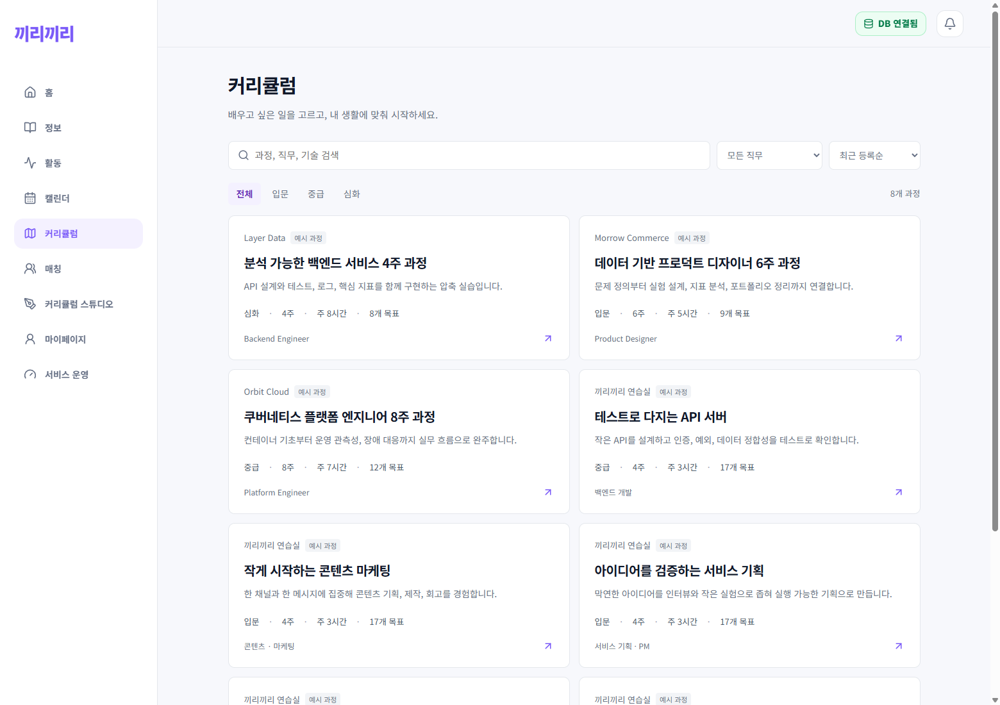
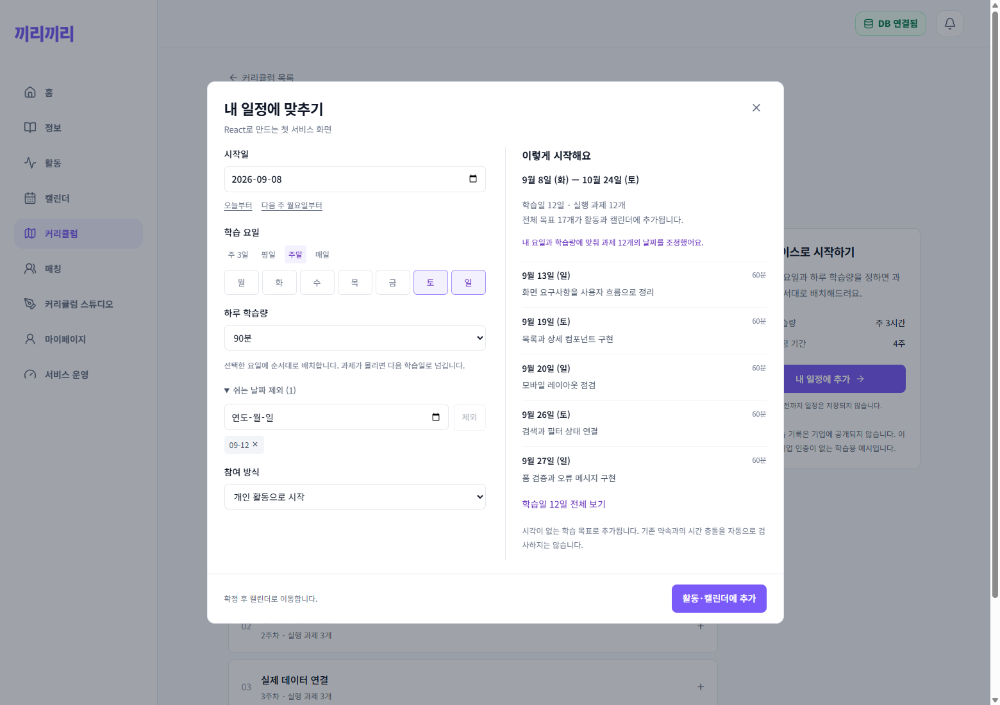

# 커리큘럼 탐색과 일정 배치 개선

## 화면

- 목록의 대형 그라데이션 배너, 장식 아이콘·단계 카드, 기업별 색상과 떠오르는 카드 효과를 제거했다. 공통 앱 배경·주색과 Noto Sans KR를 유지한다.
- 검색, 직무·난이도 필터, 짧은 과정순·주간 부담 적은순 정렬을 제공한다.
- 상세는 결과물 설명, 주차별 펼침 목록, 일정 추가로 구성한다. 모든 일일 과제를 확인할 수 있으며 8개 이후 과제를 숨기던 제한은 제거했다.
- 예시 과정은 실제 인증·채용 연계로 오인하지 않도록 목록·상세에 표시하고 API의 인증 여부도 false로 반환한다. 기존 기업 레코드는 덮어쓰지 않는다.

## 내 일정에 추가

- 오늘/다음 주 월요일, 주 3일/평일/주말/매일 빠른 선택.
- 하루 30~240분 선택, 쉬는 날짜 개별 제외·제외 취소.
- 조건 변경 후 300ms 디바운스로 서버 미리보기를 갱신한다. 이전 요청 취소 및 요청 키 비교로 오래된 결과의 저장을 막는다. 폴링·외부 AI 호출은 없다.
- 원래 날짜 이후의 선택 요일만 사용한다. 과제를 시간 순서로 배치하고, 하루 학습량이 차면 다음 학습일로 이동한다. 기존의 ‘가능 요일이 원래 구간에 없으면 불가능 요일로 복귀’ 오류를 수정했다.
- 긴 단일 과제는 쪼개지 않고 하루에 단독 배치하며 경고한다. 예상 시간이 없는 과제는 배치 계산에 60분을 사용하고 안내한다.
- 일일 과제가 뒤로 이동하면 연결된 주간·월간 부모 목표의 종료일도 확장한다. 휴일 제외는 일일 실행 날짜에 적용되며 상위 목표 기간에서 휴일을 잘라내지는 않는다.
- 미리보기와 등록이 동일한 서버 함수를 사용하며 설정을 enrollment에 보관한다. 과정 버전이 바뀌면 재확인을 요청한다.
- 확정하면 새 개인/팀 활동과 목표를 저장하고 캘린더로 이동한다. 팀 모집 공개는 기본 OFF. 저장 중 중복 클릭은 차단한다.
- 시간 약속이 아닌 날짜별 목표다. 기존 약속 자동 충돌 회피, 반복 예약, 긴 과제의 분할, 기존 활동에 병합하는 기능은 포함하지 않는다.

## 예시와 실행

`npm --prefix server run seed:curricula`로 기존 3개와 신규 5개를 중복 없이 추가한다. 조직/과정 slug가 있으면 건너뛰며 기존 과정은 변경하지 않는다. 신규 과정은 React, SQL, 서비스 기획, 콘텐츠 마케팅, API 테스트 각 4주 과정이며 과정마다 월간 1개·주간 4개·일일 12개 목표를 포함한다. 로컬 `kkiri_local:3307`에 총 8개 예시를 저장했다.

웹 수정은 Vite에서 반영되며 API의 일정 로직 변경은 서버 재시작이 필요하다. 새 DB 테이블이나 패키지 설치는 필요 없다.

## 검증 (2026-09-08)

- `npm --prefix web run build`: 타입 검사·프로덕션 빌드 통과.
- `npm --prefix server test`: 97개 통과. 일정/예시 관련 11개에는 고정 날짜 요일 이동, 부모 기간 확장, 하루 학습량, 긴 과제, 잘못된 입력, 연말 휴일, 반복 호출 일치, 원본 보존과 예시 계층 검사가 포함된다.
- 실제 브라우저에서 검색·필터·빈 결과, 자동 미리보기, 주말/휴일 배치, 전체 일정 펼치기, 팀 생성과 캘린더 이동 확인.
- 저장 후 DB의 목표 날짜와 API 응답이 미리보기와 일치하고 설정이 보존되는지 확인. 개인 생성, 잘못된 요일 400, 버전 불일치 409도 확인했다.
- 390/820/1100/1560px 목록·상세·일정 설정 가로 넘침, 모바일 확정 버튼, Escape 닫기 확인.
- 검증용 활동 2개와 소속 목표·멤버십·등록 레코드만 삭제했다. 사용자의 기존 활동과 추가 예시 과정은 유지했다.
- [검증 기록](../../screenshots/2026-09-08-curriculum/verification.json)

[상세 화면](../../screenshots/2026-09-08-curriculum/detail-desktop.png) · [모바일 목록](../../screenshots/2026-09-08-curriculum/catalog-mobile.png) · [모바일 상세](../../screenshots/2026-09-08-curriculum/detail-mobile.png) · [모바일 일정 설정](../../screenshots/2026-09-08-curriculum/schedule-mobile.png) · [모바일 미리보기](../../screenshots/2026-09-08-curriculum/schedule-mobile-preview-final.png)

관련 이슈: #119. 캘린더 PR #118 위에 쌓은 별도 변경이다.

## 기업 아이콘 추가

목록·검색 결과 카드와 상세에 공통 기업 아이콘을 추가했다. API의 `organization_logo_url`을 우선 사용하고 비율을 유지한다. 로고가 없거나 로딩에 실패하면 예시 기업은 조직 slug에 대응하는 기존 Lucide 아이콘, 일반 기업은 대표 문자를 사용한다. 같은 기업의 과정은 같은 아이콘이며 예시 아이콘은 공식 로고가 아니다. 별도 로고 수집 서비스나 DB 변경은 없다.

웹 빌드와 PC·390px 모바일 표시, 8개 과정/4개 조직 아이콘 구분, 이미지 URL 표시·실패 시 대체·URL 변경 후 복구를 브라우저에서 확인했다. [목록](../../screenshots/2026-09-08-curriculum/icons-catalog-desktop.png) · [상세](../../screenshots/2026-09-08-curriculum/icons-detail-desktop.png) · [모바일](../../screenshots/2026-09-08-curriculum/icons-catalog-mobile.png). 이전 스크린샷은 보존했다.
