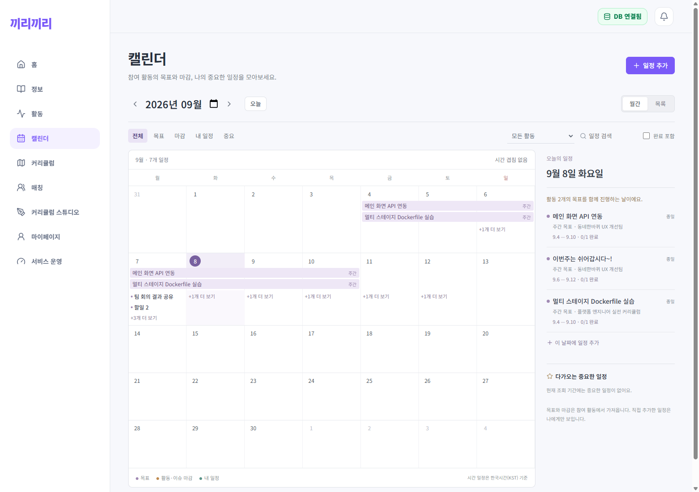

# 웹 캘린더

활동 다음에 `캘린더` 탭을 추가했다. `/calendar`에서 참여 중인 활동의 내 목표, 활동 마감, 담당 이슈(또는 내가 작성한 미배정 이슈)의 마감과 개인 일정을 확인한다.

- 월간 달력의 기간 막대와 날짜별 목록. 일/주/월 목표와 일별 행으로 저장된 구간 목표를 통합한다.
- 날짜 선택, 월 이동, 오늘, 목록 보기, 활동/종류/중요/검색/완료 필터.
- 개인 일정의 제목·날짜·종일/시간·중요·완료·메모·연결 활동을 저장/수정하고 삭제할 수 있다. 연결 활동이 있어도 개인 일정은 작성자에게만 보인다.
- 시간 약속은 시작 포함/종료 제외로 충돌을 계산한다. 종일 목표와 완료 일정은 시간 충돌에서 제외한다. 마감 몰림, 서로 다른 활동의 목표 병행은 별도 안내다.
- 충돌 안내는 필터로 숨겨진 일정도 포함한다. 목표 링크는 해당 활동의 조회 날짜와 기간 종류로 연결된다.
- 모바일 날짜 선택 시 상세로 이동하고 달력으로 돌아올 수 있다. 창으로 복귀하면 일정을 갱신한다.

## 데이터와 실행

`GET /api/calendar?start=YYYY-MM-DD&end=YYYY-MM-DD`는 최대 62일을 조회한다. 토큰의 사용자와 현재 팀 참여 여부로 범위를 제한하고, 한 번의 요청에서 4개 SQL로 조회한다. 소스별 5000행 제한을 넘으면 일부를 조용히 누락하지 않고 오류를 반환한다. 추가 외부 서비스나 패키지는 없다. 캘린더 코드는 해당 탭을 열 때만 내려받는다.

`POST /api/calendar/events`, `PUT /api/calendar/events/:id`, `DELETE /api/calendar/events/:id`는 서명된 로그인 토큰이 필요하다. 수정은 소유자와 버전이 일치해야 하며, 삭제는 `deleted_at`을 기록한다. 사용자별 데이터는 `private, no-store`로 응답한다.

신규 `calendar_events` 테이블은 서버 시작 시 멱등 생성한다. 신규 DB용 `server/schema/base.sql`에도 동일 스키마를 포함했다. 시간 일정은 한국시간(KST)이며 외부 캘린더 연동·반복 일정·팀 공유 일정은 포함하지 않는다.

## 검증 (2026-09-08)

- 웹 타입 검사 및 프로덕션 빌드 통과.
- 캘린더/기존 목표 날짜 테스트 13개, 서버 회귀 테스트 91개 통과.
- 실제 로컬 API/DB로 개인 일정 생성·새로고침·수정·삭제, 겹침 발생/해소, 오래된 버전 수정 차단 확인.
- 실제 구간 목표 3일분을 생성한 뒤 중간 하루만 조회해도 막대 1개·전체 목표 3개로 집계됨을 확인.
- 실제 활동 마감과 중요한 이슈 마감 통합 조회, 목표의 활동/날짜 링크 확인.
- 390/820/1100/1560px 가로 넘침, 모바일 편집창, 날짜 상세 이동/복귀 확인.
- 검증 목적으로 생성한 개인 일정·구간 목표·이슈는 모두 삭제했다. 기존 데이터는 유지했다.
- [동작 검증 기록](../../screenshots/2026-09-08-calendar/verification.json)

[모바일 화면](../../screenshots/2026-09-08-calendar/final-calendar-mobile.png) · [검증용 약속 두 개로 확인한 충돌 표시](../../screenshots/2026-09-08-calendar/final-calendar-overlap-qa.png)

관련 이슈: #117. 선행 화면 개선 PR #116 위의 별도 캘린더 커밋으로 구성한다.

## 디자인 피드백 반영 (2026-09-08)

- 별도 보라·청록·갈색 팔레트를 제거하고 공통 `--primary`, `--primary-dark`, `--primary-soft`, `--text-sub`, `--border`를 사용한다. 오류·충돌에는 기존 앱의 오류 색상을 사용한다.
- 오늘은 주색 채움 원, 다른 선택 날짜는 주색 테두리 원으로 구분한다. 오늘을 선택해도 강조는 하나만 표시하며 날짜 칸 상단/하단의 중복 배경은 없앴다.
- 장식용 격자 배경과 도구 영역·상세 목록의 불필요한 가로선을 제거했다. 주 구분선은 유지한다.
- 상세 영역도 홈과 같은 흰색 표면과 공통 테두리로 통일했다. 전체 페이지 배경은 공통 레이아웃을 그대로 사용한다.
- 실제 API 데이터로 오늘/다른 날짜 선택, 홈과 배경색 일치, 390/820/1100/1560px 가로 넘침, 목록 전환과 편집창 확인 및 웹 빌드를 통과했다. 검증 중 일정 데이터는 변경하지 않았다.
- 기존 스크린샷을 보존하고 수정 후 화면을 별도 저장했다: [데스크톱](../../screenshots/2026-09-08-calendar/brand-calendar-desktop.png) · [다른 날짜 선택](../../screenshots/2026-09-08-calendar/brand-calendar-selection.png) · [모바일](../../screenshots/2026-09-08-calendar/brand-calendar-mobile.png) · [검증 기록](../../screenshots/2026-09-08-calendar/brand-verification.json).
