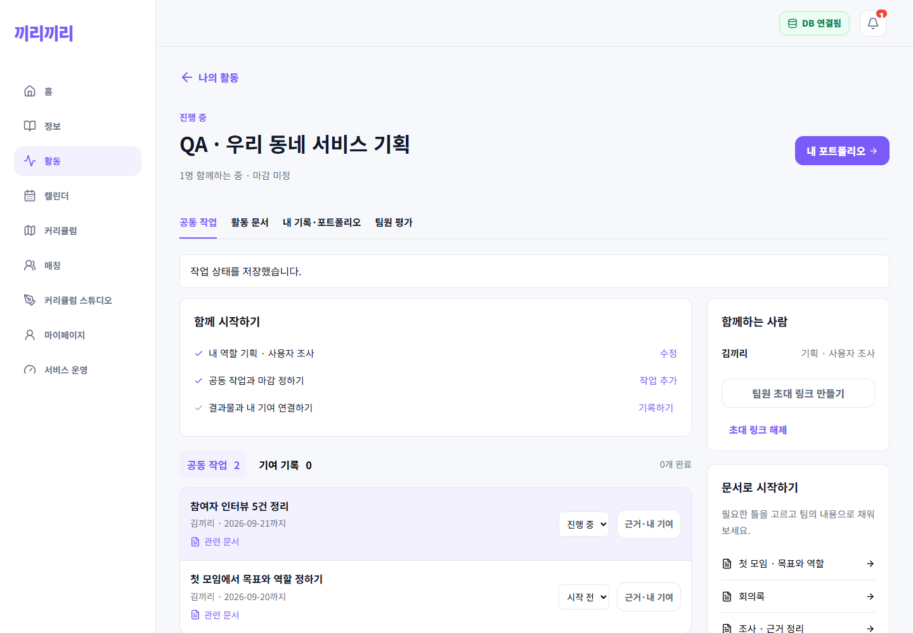
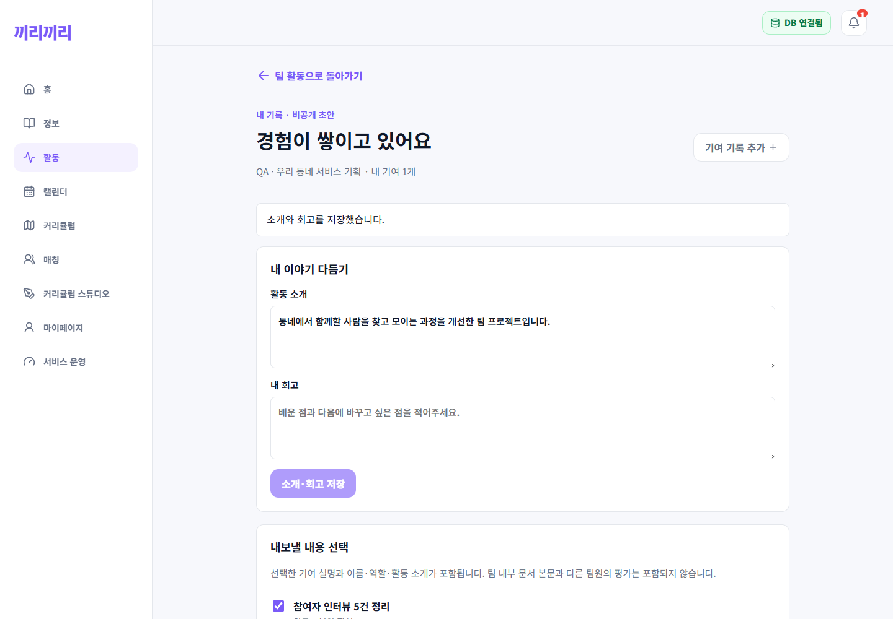
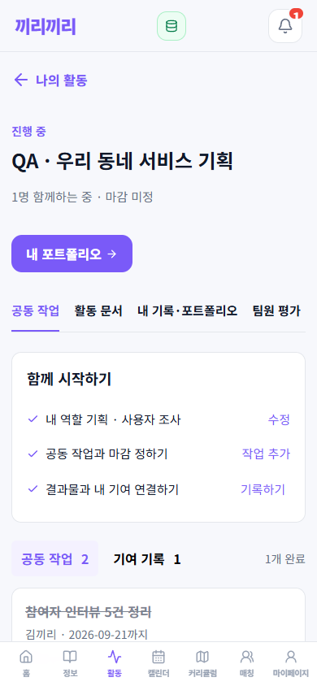
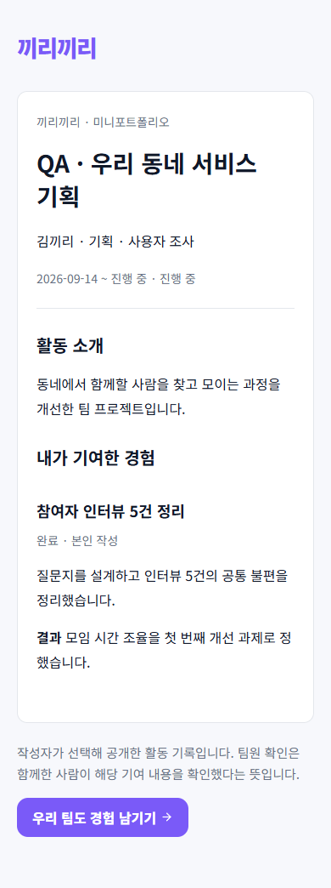

# 팀 활동 → 근거 → 개인 포트폴리오

## 적용 범위

웹의 기존 활동 도구를 유지하면서 공동 작업·문서·내 기여·포트폴리오를 연결한다. 서버 API와 스키마는 앱에서도 사용할 수 있지만, 이번 신규 화면은 웹에만 구현했다.

- 활동 탭에서 공고 없이 팀 시작, 공고 상세에서 해당 공고를 선택한 모집/팀 생성.
- 로그인 뒤 원래 진입하려던 화면 복귀. 합류 제안 수락 뒤 해당 팀 공동 작업으로 이동.
- 최초 회의록과 첫 주간 목표 준비. 문서 템플릿 4종(첫 모임, 회의, 조사, 결과·회고).
- 담당자·마감·문서를 연결한 공동 작업. 진행 중 강조, 완료는 회색·취소선. 상태 변경으로 순서를 바꾸지 않는다.
- 작업마다 본인이 맡은 일·결과·문서/외부 링크 기록. 본인 작성과 팀원 확인을 구분하며, 내용 수정 시 확인 초기화.
- 활동 중에도 개인 포트폴리오 초안에 기록 표시. 소개·회고 편집, 최대 30개 기록 선택, 공유 미리보기, 링크/PDF 내보내기.
- 공유본은 게시 시점 스냅샷. 재게시 시 링크 회전, 공유 해제 가능. 공개 경험을 다음 모집 지원 내용에 첨부.
- 진행 → 마무리 → 보관. 기한 만료만으로 자동 보관하지 않는다. 완료한 팀의 문서·기여·평가는 계속 접근 가능.
- 평가 API에서 동일 팀·타인·평점·코멘트 검증, 반복 요청 직렬화. 완료 팀 평가 허용.

## API와 저장

`/api/journey` 하위:

| 경로 | 용도 |
| --- | --- |
| GET /templates, GET /shares | 문서 틀 / 내 공개 경험 |
| POST /teams | 팀 및 첫 문서·주간 작업 생성 |
| GET /teams/:id | 팀 작업·문서·기여 조회 |
| POST /teams/:id/tasks, PUT /teams/:id/tasks/:todoId | 작업 생성·상태 |
| POST /teams/:id/records | 내 기여 저장 |
| PUT /teams/:id/records/:recordId/confirm | 팀원 확인·취소 |
| GET/PUT /teams/:id/draft | 개인 소개·회고·초안 |
| POST/DELETE /teams/:id/share | 선택 공유·해제 |
| POST /teams/:id/pdf | 선택 기록 PDF |
| POST/DELETE /teams/:id/invite | 팀장 초대 링크 관리 |
| GET /invite/:token, POST /invite/:token/accept | 초대 조회·합류 |
| GET /share/:token | 익명 공개본 조회 |
| PUT /teams/:id/phase | 마무리·보관 |

기존 MySQL에 `journey_team_state`, `journey_task_documents`, `journey_records`, `journey_confirmations`, `journey_reflections`, `journey_invites`, `journey_shares` 7개 테이블을 추가한다. 기존 행을 초기화하지 않는다. API 시작 시 문서·포트폴리오 스키마 준비 후 생성한다. 배포 전 DB 백업과 DDL 권한 확인이 필요하다.

## 권한·비용 정책

- 새 개인 API는 서명된 Bearer 인증만 허용한다. 본문 user_id / x-user-id로 인증하지 않는다.
- 작업 담당자와 연결 문서는 같은 팀만 허용한다. 초대 수락과 보관은 팀 행 잠금으로 직렬화하고, 수락 시 현재 정원·만료·해제를 재확인한다.
- 공유는 내 기록만 허용하는 필드 허용목록을 사용한다. 내부 문서 본문, 다른 팀원 이름·평가, 내부 ID는 제외한다.
- 공개 링크를 가진 사람은 열람할 수 있다. 256비트 무작위 토큰, no-store/noindex, 외부 링크 referrer 차단을 사용하지만 복사·캡처된 자료까지 회수할 수는 없다.
- 외부 결과물 URL은 자동으로 가져오거나 권한을 바꾸지 않는다. HTTP(S)만 허용하며 포함 여부는 사용자가 선택한다.
- 계정 탈퇴 시 이번 기능의 개인 공유본·기여·회고·확인을 삭제하고 본인이 관리하던 초대 링크를 해제한다.
- 유료 AI, 외부 파일 복제, 상시 동기화 서비스 없음. 기존 DB·문서 저장과 요청 시 PDF 생성만 사용한다. 일반 요청 IP당 분당 180회, 팀 생성 사용자당 분당 10회, PDF 사용자당 분당 3회 제한.
- 조회는 작업·기여 각 500개, 문서 200개까지 제한한다. 대규모 장기 팀을 위한 페이지 단위 조회는 후속 과제다. 실시간 공동 커서 편집, 외부 GitHub/Figma 자동 검증, 채용 결과 추적은 이번 범위에 포함하지 않는다.
- 팀원 확인은 동료가 기여 내용을 확인했다는 뜻이지 외부 기관의 검증·인증이 아니다.

## 검증

- 서버 기존 회귀 97개 + 신규 단위/권한 6개 + 실제 MySQL 통합 1개, 총 104개 통과. 웹 프로덕션 빌드와 변경 웹·신규 모듈 lint 오류 없음. 기존 server.js 전체 lint에는 이번 변경 밖의 `crawlerRunning` 미정의 오류 1개가 남아 있다.
- 통합 테스트: 첫 문서 연결, 기한 지난 팀 유지, 동시 합류 정원, 외부 팀 ID 거부, 자기 확인 거부, 수정 시 확인 무효화, 공개 허용목록, 스냅샷 고정, PDF 바이트, 링크 해제, 보관 후 기록 접근.
- 별도 QA API:3001 / 웹:5174 / MySQL:3308에서 실제 Chrome 자동 테스트. 로그인 복귀, Markdown 표 DB 저장, 문서→작업, 기여→공유, 익명 공개본, 모바일 가로 넘침, 완료 팀 평가 저장 확인.
- `scripts/qa-team-journey.js`는 DB 상태가 `kkiri_journey_qa` / 3308인지 확인한 후 실행한다. 실행마다 별도 스크린샷 폴더를 만든다.
- `server/journey/integration.tests.js`는 `JOURNEY_DB_TEST=1`일 때만 실행하며 별도 QA DB만 사용한다. 일반 `npm test`는 DB가 필요 없다.

## 이번 로컬 실행에서 발견한 별도 문제

기존 회원 DB(3307)가 InnoDB redo log의 데이터 디렉터리 불일치 오류로 시작되지 않았다. 기존 DB 파일을 삭제·재초기화하거나 검증 DB로 대체하지 않았다. 별도 DB 복구가 필요하며, 이번 결과는 QA 데이터로 검증했다. 운영 배포나 기존 회원 DB 연동 정상화 완료를 의미하지 않는다.

## 화면 캡처 (QA 데이터)

