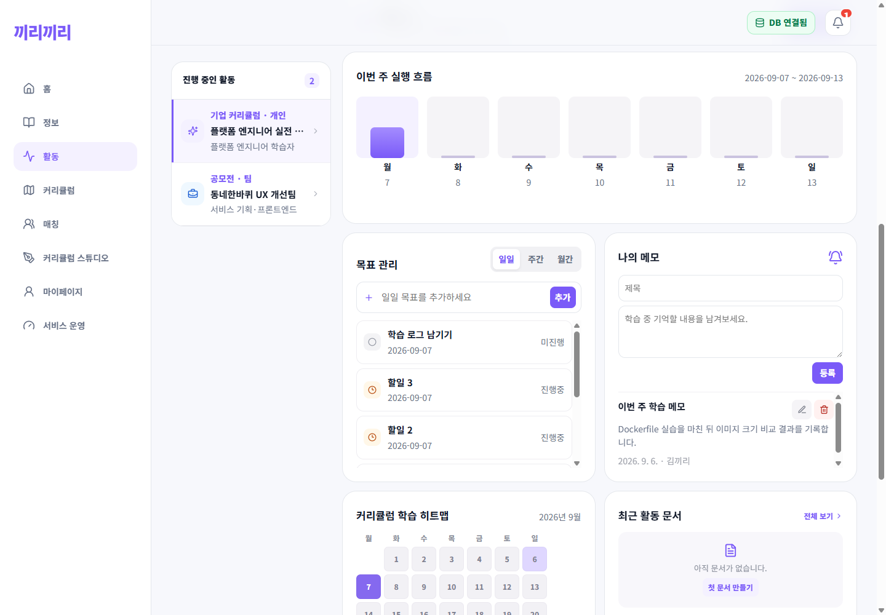
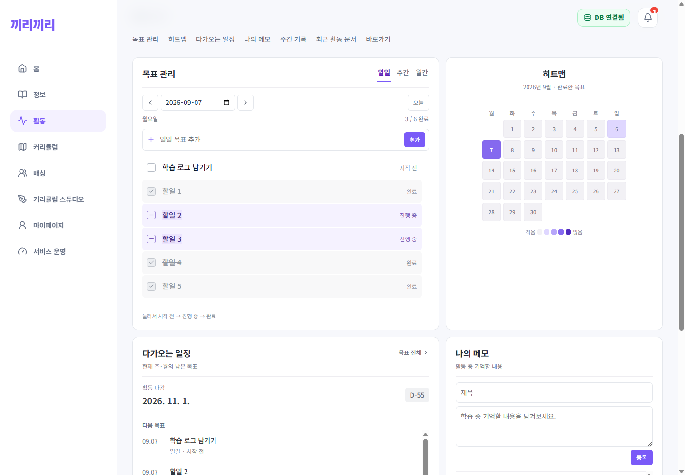
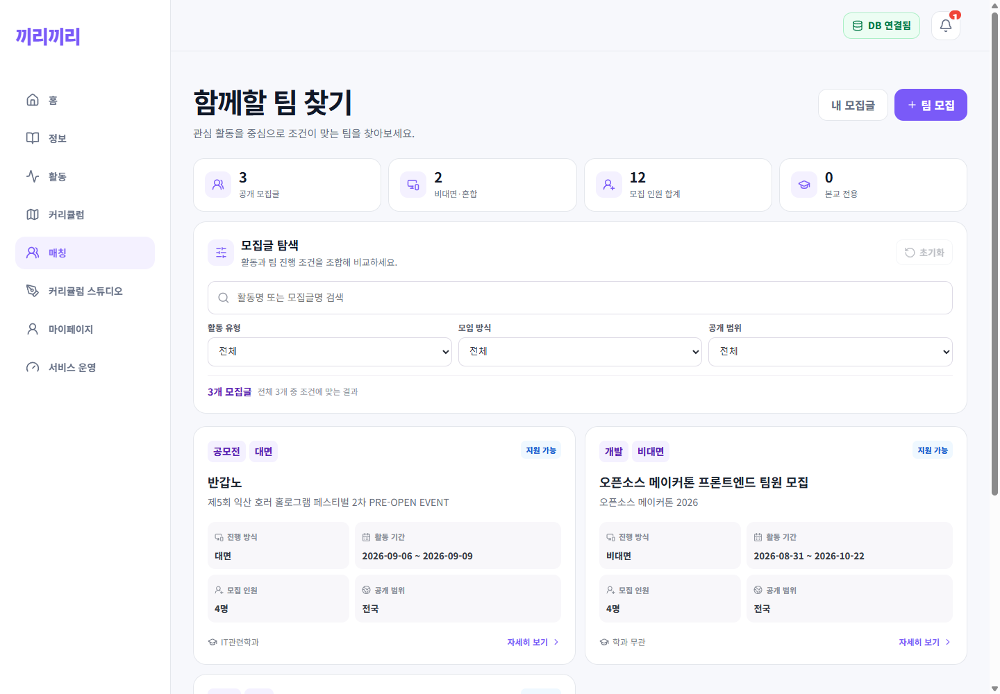
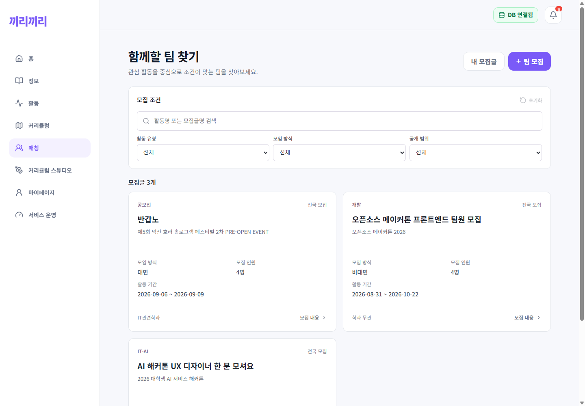

# 활동·매칭 화면 개선 검증

검증일: 2026-09-07 (한국 시간). 연결 이슈: [#115](https://github.com/C4t4ddict/kkiri-kkiri/issues/115).

## 결과

실행 중인 웹 작업트리를 `origin/develop`의 최신 코드에서 분기해 수정했다. 목표의 등록 순서를 유지하고, 조회 날짜와 저장 기간을 일치시켰다. 활동의 중복 선택 패널·큰 진행률 영역을 줄여 목표와 히트맵이 먼저 보이도록 배치했다. 매칭은 최대 폭 1040px, 데스크톱 2열/모바일 1열로 정리했다.

## 화면별 확인

1. **활동 선택과 도구 탐색 — 통과.** 활동 드롭다운·카테고리 전환, 도구 바로가기, 그리드 크기·순서 편집 및 새로고침 후 보존을 확인했다. 제목과 여백을 기준으로 도구를 구분하고 장식용 아이콘·중복 강조 박스를 줄였다. 사용자 지정 배치는 보존하며, 과거 기본 배치 그대로인 경우만 새 기본값으로 이관한다.
2. **목표 날짜·저장·상태 — 통과.** 이전/다음/오늘/직접 날짜 선택, 일·주·월 기간, 월말·연도 경계를 확인했다. 실제 API로 미래 날짜 목표 2개를 생성하고 등록된 날짜를 재조회했다. 시작 전→진행 중→완료→시작 전 전환에도 모든 행의 순서가 유지된다. 진행 중은 하이라이트와 상태 문구, 완료는 회색·취소선·체크 표시로 구분한다. 테스트로 만든 목표만 삭제했다.
3. **히트맵·다가오는 일정 — 통과.** 제목을 히트맵으로 줄이고 제목/달력/범례를 가운데 정렬했다. 활동 마감과 다음 목표를 날짜 중심의 단순 목록으로 변경했다. 달력 중앙과 카드 중앙의 차이는 2px 미만이다. 마감 날짜와 D-day는 로컬 날짜 기준으로 일치한다.
4. **매칭 탐색 — 통과.** 과도한 통계 타일과 중첩된 정보 박스를 줄였다. 검색 결과 없음, 초기화, 비대면 필터를 실제 모집 데이터로 확인했다. 제목·활동명·모임 방식·인원·기간 순서로 정보를 묶었다.
5. **홈 로고 — 통과.** 검색창 옆 회전 로고를 실행 작업트리와 Git에 포함했다. 단어 전환 시작 간격을 4000ms로 설정했고 브라우저 실측은 약 4013ms였다. `prefers-reduced-motion`일 때 이동 애니메이션은 꺼진다.

## 자동 검사

- `npm run web:build`: 타입 검사 및 프로덕션 빌드 통과.
- `node node_modules/typescript/bin/tsc --noEmit`: 앱 타입 검사 통과.
- `node node_modules/jest/bin/jest.js --runInBand --watchman=false __tests__/goalPeriod.test.ts __tests__/App.test.tsx`: 7개 통과.
- `npm test` (`server`): 85개 통과.
- `git diff --check`: 통과.
- 실제 Chrome + 로컬 API/MySQL 통합 검증: [검증 기록](../../screenshots/2026-09-07-workspace/verification.json).
- 390/820/1100/1440px에서 활동·매칭 화면의 가로 넘침 없음.

## 스크린샷

기존 스크린샷은 삭제하지 않았다. `before-*`는 변경 전, `after-*`는 중간 확인, `final-*`는 최종 검증이다.

### 활동 도구

### 매칭

### 모바일 및 홈

- [390px 활동](../../screenshots/2026-09-07-workspace/final-activity-390.png)
- [390px 매칭](../../screenshots/2026-09-07-workspace/final-matching-390.png)
- [홈 로고](../../screenshots/2026-09-07-workspace/final-home.png)

## 범위와 한계

- 화면 점검 결과를 바탕으로 정보 순서·밀도·타이포그래피를 조정했다. 기존 브랜드 색과 서체는 유지했다.
- 테스트용 계정의 실제 로컬 DB 데이터를 사용했으며 API를 가짜 응답으로 대체하지 않았다. 운영 배포 또는 운영 DB 변경은 수행하지 않았다.
- 웹의 동작·화면 폭·키보드 그리드 편집·모션 감소를 확인했다. 스크린리더 전체 흐름, 모든 색상 대비, iOS/Android 실기기까지 검증했다는 의미는 아니다.
- 직전 세로 띠 제거에서 빠진 Markdown 인용문과 웹/모바일 장식용 강조 띠도 이번 커밋에 포함한다. 기능용 캘린더 격자선은 유지한다.
- 날짜가 없는 옛 목표의 API fallback은 기존 클라이언트용으로 유지한다. 웹은 `exact_period=1`로 요청해 빈 날짜마다 옛 목표가 반복 노출되지 않게 한다. DB 스키마 변경은 없다.

## 기존 GitHub 작업 상태

확인 시점에 최근 PR #104(문서), #106(도구 그리드), #108(로그인), #110(트래픽), #112(활동 카탈로그), #114(DB 복구)는 병합되어 있었다. 그러나 모든 과거 작업이 정리된 상태는 아니었다.

기존 열린 PR은 #39, #56, #58, #60, #71, #74, #76 총 7개다. 이번 범위와 다른 오래된 PR은 임의로 병합하거나 닫지 않았다. 별도 루트 체크아웃의 기존 미커밋 변경·문서·업로드 파일 역시 덮어쓰거나 일괄 커밋하지 않았다.

이번 변경은 실행 중인 `activity-catalog` 작업트리의 `codex/workspace-readability` 브랜치에 정리한다. 사용자 업로드 이미지 `server/uploads/59ea1aa6-3a6c-48ee-bd21-4c220fc2596b.png`는 작업 전부터 존재한 파일이므로 이번 커밋에서 제외한다.
