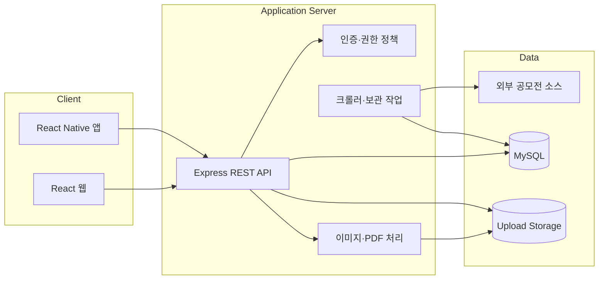
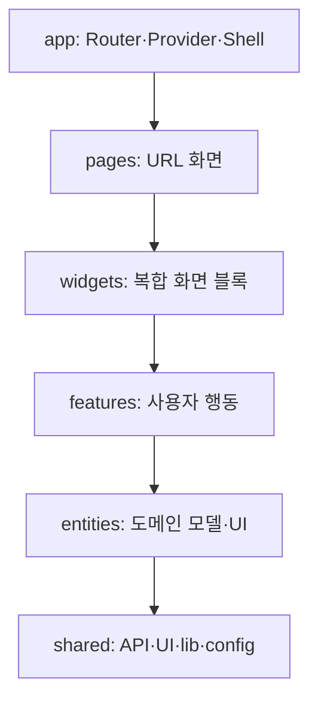
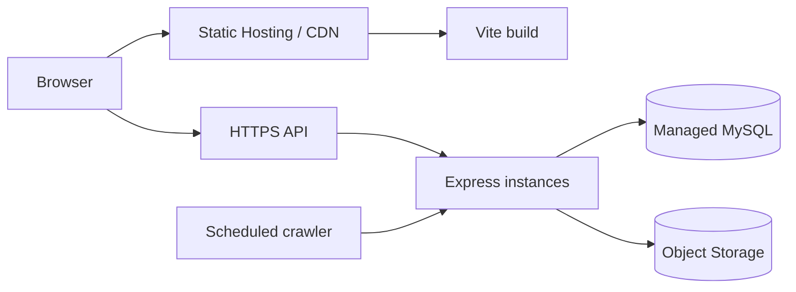

# 시스템 아키텍처

## 1. 목표

React Native 앱과 React 웹이 같은 사용자·활동·팀·목표 데이터를 사용하면서도 플랫폼별 UI를 독립적으로 발전시킬 수 있는 구조를 만든다.



## 2. 경계 원칙

- 앱과 웹은 DB에 직접 접근하지 않는다.
- Express API가 인증, 권한, 상태 전이, 데이터 정규화를 담당한다.
- 클라이언트는 플랫폼 UI와 사용자 상호작용을 담당한다.
- 크롤러 원본과 가공 활동 데이터는 분리 저장한다.
- 파일 저장 위치가 로컬 디스크에서 object storage로 바뀌어도 API 계약은 유지한다.

## 3. 저장소 구조 목표

현재 단일 저장소를 유지하고 공통 계약만 package로 분리한다.

```text
kkiri-kkiri/
├── src/                     # React Native 앱
├── web/                     # React 웹
├── server/                  # Express API와 background job
├── packages/
│   ├── contracts/           # API DTO, 상태 enum, validator
│   └── design-tokens/       # 색상, 간격, radius, 상태 의미
├── docs/
│   └── web/                 # 웹 설계 문서
└── scripts/                 # 개발·검증 자동화
```

React Native UI와 DOM UI는 렌더링 체계가 다르므로 화면 컴포넌트를 무리하게 공유하지 않는다. 다음만 공유 대상으로 본다.

- API request/response 타입
- 상태값과 카테고리 사전
- 날짜·금액·권한 순수 함수
- 디자인 token의 의미와 원시값

## 4. 웹 프론트 계층



- 같은 계층끼리 순환 참조하지 않는다.
- `shared`는 도메인 이름을 몰라야 한다.
- `entities`는 page나 widget을 import하지 않는다.
- route 단위 code splitting을 적용한다.

## 5. 데이터 흐름

### 조회

1. Page가 URL parameter와 filter를 해석한다.
2. Widget 또는 feature query hook이 API client를 호출한다.
3. DTO adapter가 서버 응답을 domain model로 정규화한다.
4. Entity UI가 상태에 따라 렌더링한다.
5. 캐시는 사용자 ID, 학교 범위, filter를 포함한 key로 구분한다.

### 변경

1. Form schema가 클라이언트 입력을 1차 검증한다.
2. Mutation이 API에 요청한다.
3. 서버가 인증·소유권·상태 전이를 다시 검증한다.
4. 성공 시 관련 query를 갱신한다.
5. 실패 시 서버의 사용자 메시지를 표시하고 이전 상태를 유지한다.

## 6. 인증과 권한

### 현재

- 로그인 API가 서명된 Bearer token을 반환한다.
- 앱과 웹이 `Authorization` header를 사용한다.
- 웹 세션은 현재 localStorage에 저장한다.

### 목표

- 웹은 HttpOnly·Secure·SameSite cookie 기반 세션을 우선 검토한다.
- cookie 전환 시 CSRF token 또는 SameSite 정책과 method별 검사를 포함한다.
- React Native는 Bearer token 방식을 유지할 수 있으므로 서버가 두 transport를 명확히 구분한다.
- 권한 정책은 공통 server middleware/service로 집중한다.

## 7. 배포 구조



- 웹 정적 파일과 API는 독립 배포 가능해야 한다.
- CORS는 허용된 운영 origin만 명시한다.
- API와 DB connection pool은 수평 확장을 고려한다.
- 업로드 파일은 장기적으로 instance local disk에 의존하지 않는다.
- crawler는 중복 실행 lock을 유지한다.

## 8. 관측성과 운영

- 모든 요청에 request ID를 부여한다.
- 로그는 JSON 구조로 남기고 token, 비밀번호, 인증코드, 개인정보를 제거한다.
- health와 readiness를 분리한다.
- API latency, error rate, DB pool, crawler 성공률을 수집한다.
- 사용자 오류와 서버 오류를 구분하고 운영 화면에는 집계만 노출한다.

## 9. 단계별 전환

1. 현재 `web/` 구조에서 token, API adapter, route guard를 정비한다.
2. `widgets`, `entities` 계층을 필요한 기능부터 도입한다.
3. 공통 contracts package를 만들고 앱·웹이 점진적으로 사용한다.
4. OpenAPI와 실제 route의 차이를 CI에서 검사한다.
5. 웹 운영 인증과 파일 저장 구조를 배포 전에 확정한다.

대규모 폴더 이동을 한 번에 하지 않는다. 기능 구현 PR에서 해당 도메인만 목표 구조로 옮긴다.
