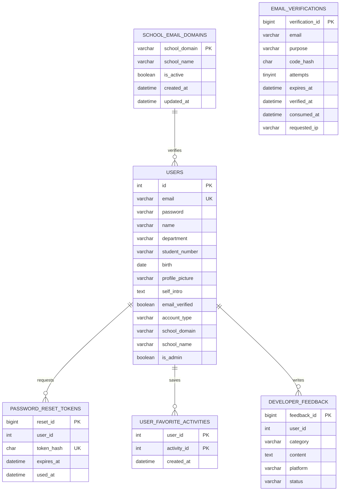
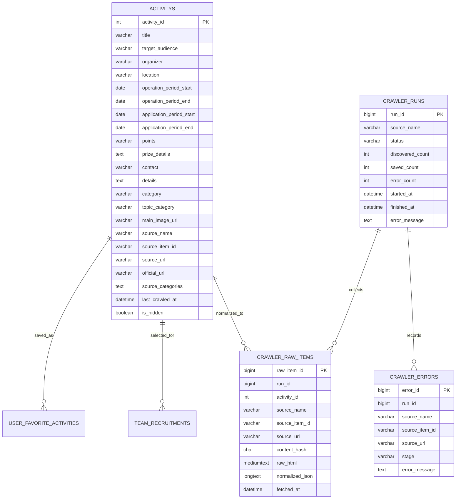
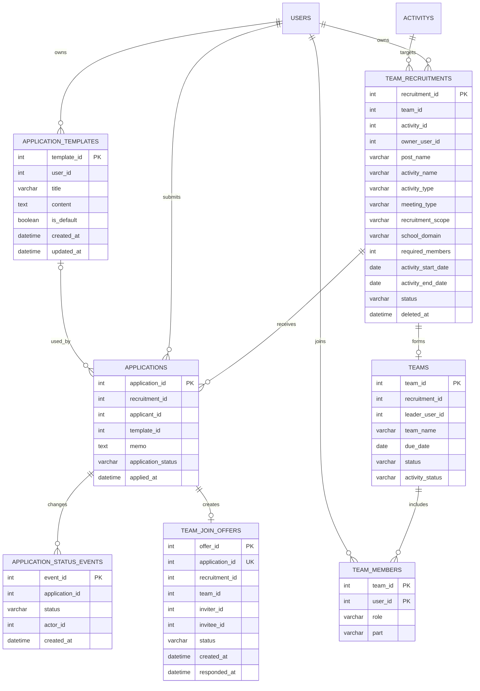
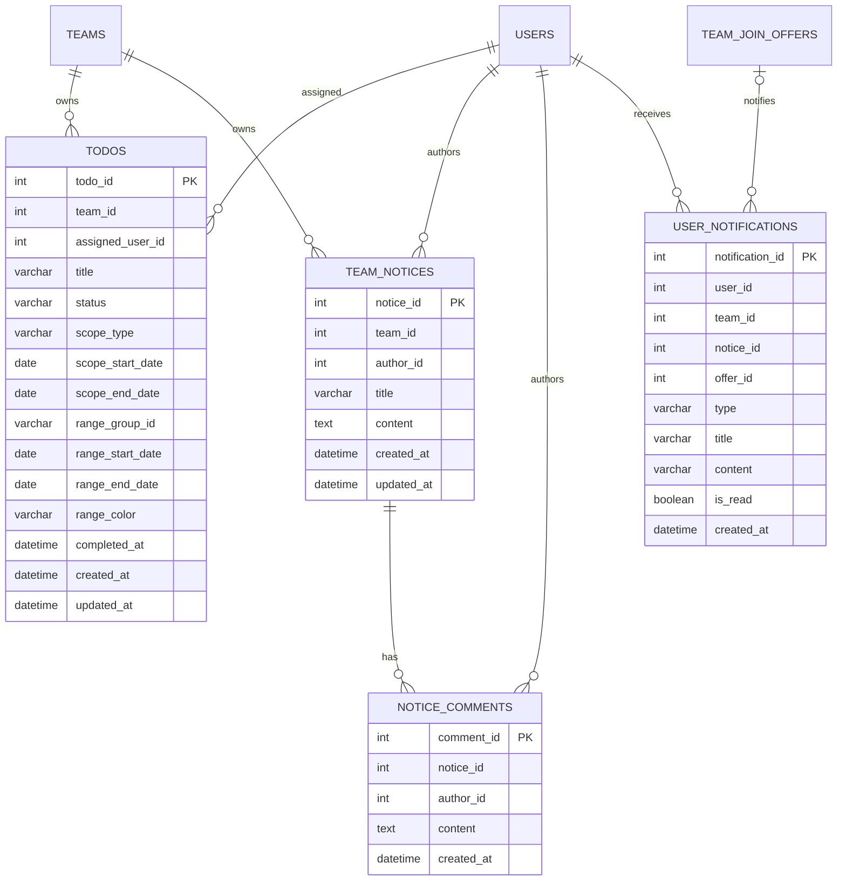
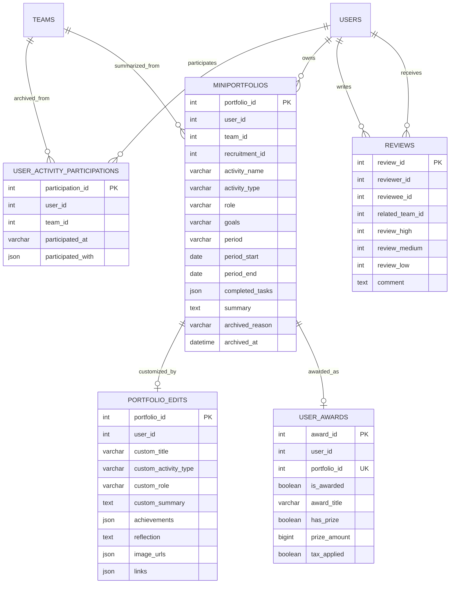

# 데이터베이스 ERD

## 1. 범위와 주의사항

이 문서는 서버 코드의 `CREATE TABLE`, `ALTER TABLE`, 조회·저장 SQL을 기준으로 작성한 **논리 ERD**다. 현재 일부 테이블은 DB 레벨 `FOREIGN KEY` 없이 인덱스와 애플리케이션 로직으로 관계를 유지한다. 아래 관계선은 참조 의미를 나타내며 실제 FK 선언을 보장하지 않는다.

`activitys`는 현재 운영 코드의 테이블명을 그대로 표기한다. 향후 `activities`로 이름을 바로잡으려면 호환 뷰 또는 단계적 마이그레이션이 필요하다.

## 2. 인증·사용자

`email_verifications.email`은 가입 전 사용자를 지원하므로 `users.id` FK가 아니다. 인증 코드와 재설정 토큰은 원문이 아니라 SHA-256 hash를 저장한다.

## 3. 활동 정보·크롤러

주요 유일 조건은 `activitys(source_name, source_item_id)`와 `crawler_raw_items(source_name, source_item_id, content_hash)`다.

## 4. 모집·지원·팀

## 5. 활동 운영·알림

`todos.status`는 현재 `미진행`, `진행중`, `완료`를 사용하고 `scope_type`은 `일일`, `주간`, `월간`, `전체`를 사용한다. 기간 목표는 같은 `range_group_id`를 가진 일일 목표 묶음이며 동시 미완료 구간은 날짜별 최대 3개다.

## 6. 지난 활동·포트폴리오·평가

## 7. 데이터 무결성 규칙

- 사용자 이메일은 정규화한 소문자로 유일해야 한다.
- 학교 모집의 `school_domain`은 작성자의 인증 학교와 일치해야 한다.
- 관심 활동은 `(user_id, activity_id)`당 하나만 존재한다.
- 미니포트폴리오는 `(user_id, team_id)`당 하나만 존재한다.
- 수상 내역은 `(user_id, portfolio_id)`당 하나만 존재한다.
- 합류 제안은 `application_id`당 하나만 존재한다.
- 지원서 템플릿 제목은 80자, 본문은 2,000자 이하로 정규화한다.
- 기간 목표는 최대 366일이며 승인된 6개 색상만 사용한다.
- 이미지 업로드는 허용 확장자·MIME·파일 시그니처를 모두 검증한다.

## 8. 후속 데이터 작업

1. 런타임 `ALTER TABLE`을 버전 관리되는 migration으로 이전한다.
2. 핵심 관계에 FK 적용 가능성을 검토하되 기존 고아 데이터 정리 후 진행한다.
3. `activitys` 명칭 변경 계획을 수립한다.
4. 친구·쪽지·마이페이지 메뉴 순서·운영자 답장 기능은 별도 테이블 설계가 필요하다.
5. 실제 운영 DB의 `information_schema`와 본 문서를 배포 전 대조한다.
